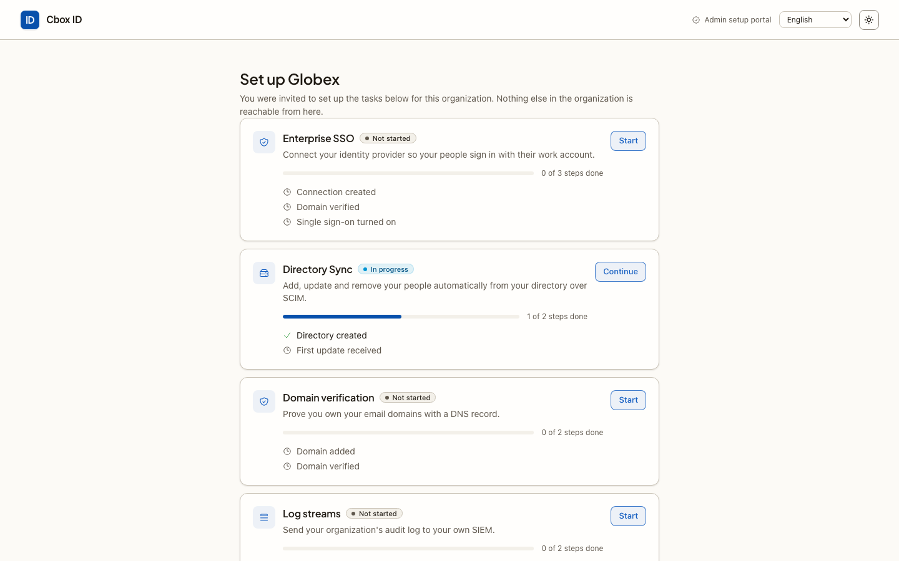

# For IT admins with a setup link

You are reading this because a product your company uses sent you a **setup link**. It is
usually in an email titled "Set up *your organization* on *product*", or pasted to you by
a colleague. The link lets you set up a few things for your company's account in that
product, such as single sign-on with your identity provider, without creating an account
there.

The product runs its sign-in on an identity service. The pages the link opens are that
service's **Admin setup portal**, shown under the product's name. You do not need to know
anything about it beyond what is on this page.

## What the link lets you do

The link covers one or more tasks, chosen by whoever sent it. You see exactly those tasks,
and nothing else in your company's account is reachable from the portal.

| Task | What you do | Guide |
|---|---|---|
| Enterprise SSO | Connect your identity provider (SAML or OpenID Connect) so your people sign in with their work account | [Enterprise SSO](sso.md) |
| Directory Sync | Let your directory add, update and remove your people automatically over SCIM | [Directory Sync](directory-sync.md) |
| Domain verification | Prove you own your company's email domains with a DNS record | [Domain verification](domain-verification.md) |
| Log streams | Send your organization's audit log to your own SIEM, to Datadog, or to an S3 or Cloud Storage bucket | [Log streams](log-streams.md) |
| SAML certificate renewal | Upload your identity provider's new signing certificate before the old one expires | [SAML certificate renewal](certificate-renewal.md) |
| Audit logs | Read what the product recorded about your organization, and export it as CSV | [Audit logs](audit-logs.md) |

For step-by-step help in your identity provider, see the guides for
[Okta](idp/okta.md), [Microsoft Entra ID](idp/entra-id.md),
[Google Workspace](idp/google-workspace.md), or any [SAML 2.0](idp/generic-saml.md),
[OpenID Connect](idp/generic-oidc.md) or [SCIM 2.0](idp/generic-scim.md) provider.

## How the link works

1. **Open the link.** You see a page titled "Set up sign-in for your organization" with an
   **Open setup** button. Nothing has happened yet: a mail scanner or chat preview that
   opens the link does not use it up.
2. **Choose Open setup** when you are ready to work. This uses the link. From now on you
   have a setup session in this browser.
3. **Work through the tasks.** The home page, **Set up** *your organization*, lists one
   card per task with its progress: Not started, In progress or Done. **All setup tasks**
   at the top of each page brings you back.
4. **Finish setup** when you are done. This closes the link for good. For a link that only
   shows audit logs, the button is **Done**.

Things to know:

- **The link works once.** After you choose **Open setup**, opening the link again shows
  "This setup link is no longer valid".
- **It expires.** The link must be opened before the date in the email; that is between
  30 minutes and 7 days after it was sent, chosen by the sender. Once opened, your setup
  session lasts **2 hours** (unless the product's operator changed that). Leaving the
  session open does not keep the link alive past that.
- **Use one browser.** The session lives in the browser you opened the link in.
- **The link is a credential.** Anyone holding it can make these changes for your
  company. Do not forward it, and finish setup when you are done.

## What you cannot change

The portal changes only what its tasks list. It cannot:

- see or change your company's users, members, roles or the product's settings;
- require single sign-on for everyone, or stop people signing up with a password on your
  domain (the product's administrators decide that, once your connection is working);
- delete an SSO connection or a directory, or pause a directory or a log stream.

Ask the person who sent you the link for any of those.

## Languages

The portal is available in English, Dansk, Deutsch, Svenska, Norsk bokmål and Français.
Use the language menu at the top of each page. Field names from your identity provider's
own screens, such as "Audience URI (SP Entity ID)", stay as your provider shows them.

## Who to contact

The portal is run for the product that sent you the link, so the person who sent it, or
that product's support, is who to ask. In particular:

- **The link has expired or was already used** — ask them for a new one.
- **A task you expected is missing** — the link does not cover it, or your company's plan
  does not include it ("This link no longer covers anything this organization's plan
  includes").
- **Something failed and the message says to ask for help** — they can see what happened
  in their audit log, where every change you make is recorded as made through the Admin
  Portal.

## Related

- [Enterprise SSO](sso.md) — the most common task, step by step.
- [Identity provider guides](idp/_index.md) — what to create in Okta, Entra ID, Google Workspace and others.
