# Screens

A tour of the Cbox ID app — the admin console and the sign-in surface. It follows the
console's own structure: nine areas, declared once in
[`ConsoleArea`](https://github.com/cboxdk/cbox-id/blob/main/app/Platform/Console/ConsoleArea.php)
and rendered by the same components on both planes.

> **The screenshots below are dated 2026-07-13 and are stale.** They were taken against a
> flat page list — Members / SSO connections / Directory sync / Roles / API clients /
> Webhooks / Audit / Settings — that the console no longer has, and several pages have
> since been renamed in the navigation (see each area). The prose is current; the images
> are not, and nothing here has been re-shot. There is also **no screenshot of the
> `/platform` section** at all, which is the part of the console the person who runs the
> deployment spends their time in.

## Two planes, one console

The same console serves an administrator of one **organization** (a tenant) and an
administrator of one **environment** (a whole IdP, holding many organizations). They see
the same product; the environment plane holds a *Tenants* area and an acting-organization
picker in addition, because it administers many organizations rather than one. A health
check (`cbox-id:doctor`) fails if the two planes ever offer different capabilities.

The deployment's own pages — environments, accounts, operators — are the **`/platform`**
section, reached from the same console by whoever has authority over the box.

## Sign-in surface

### Login

Password sign-in, plus **passwordless options**: email magic link and **passkey**
(WebAuthn) sign-in. Social buttons appear when a provider is configured. Organizations
get a branded variant at `/o/{slug}/login`.

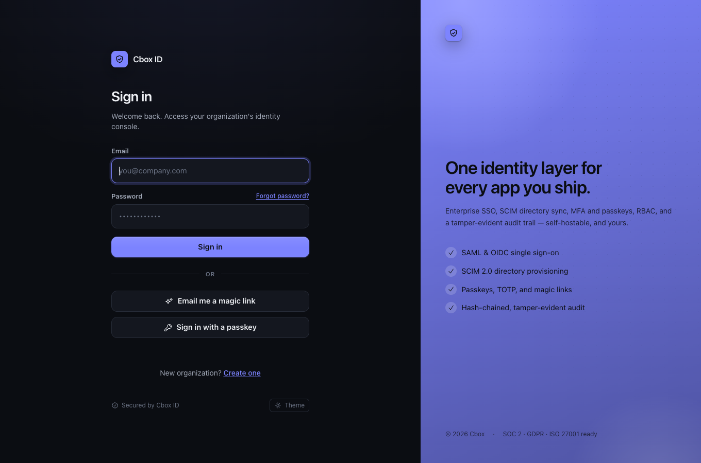

### Signup

Create a new organization and its first owner. Risk scoring runs on submit
(monitor mode by default). Availability depends on `CBOX_ID_SIGNUP_MODE` — see
[Security](../security/_index.md#self-service-signup-modes).

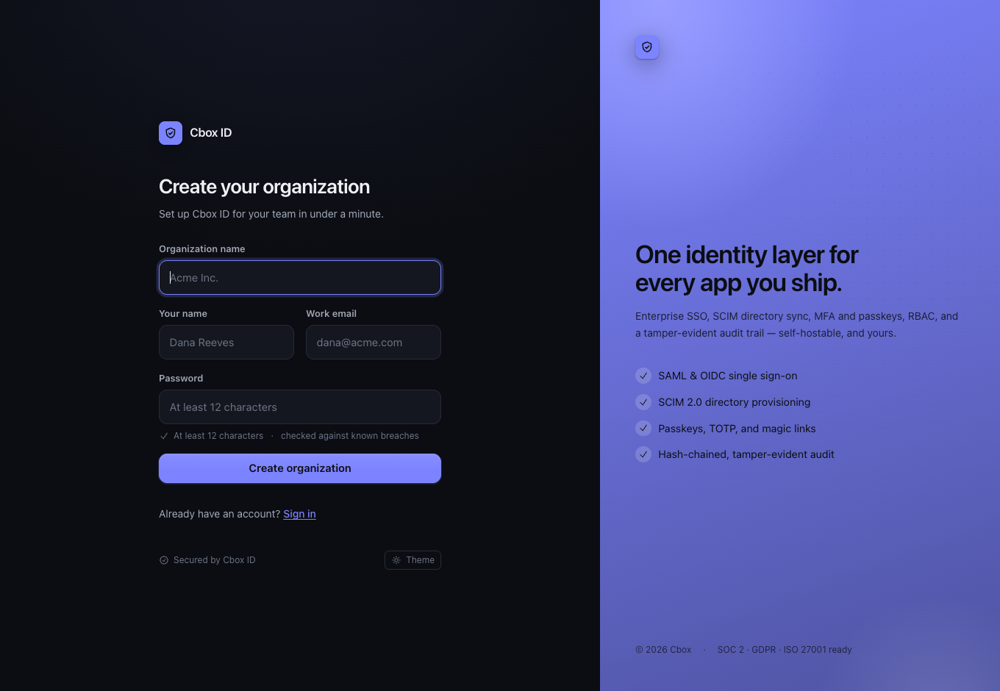

## The console, area by area

### Overview

*Overview · Usage · Agent approvals.* The home page: member count, enterprise-SSO status,
your role, a live **recent activity** feed from the tamper-evident audit log, and an
onboarding checklist.

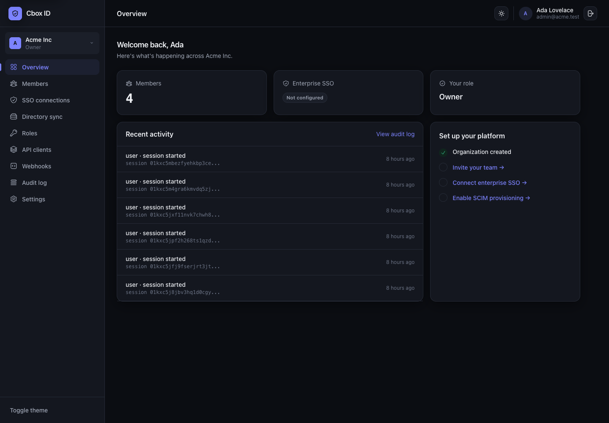

### People

*Members · Roles.* The people in this tenant and what they may do — invite, change role,
remove, every change audited — and the role/permission model itself, org-scoped and
hierarchy-aware.

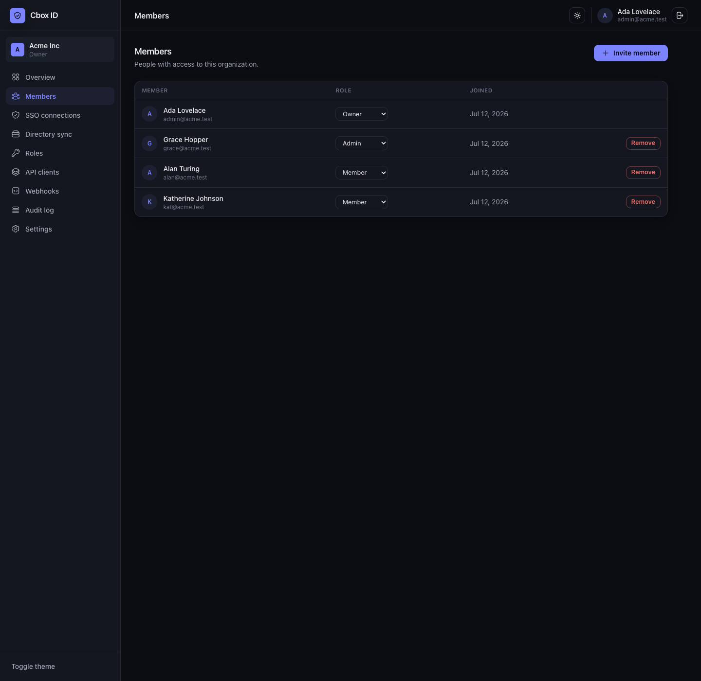
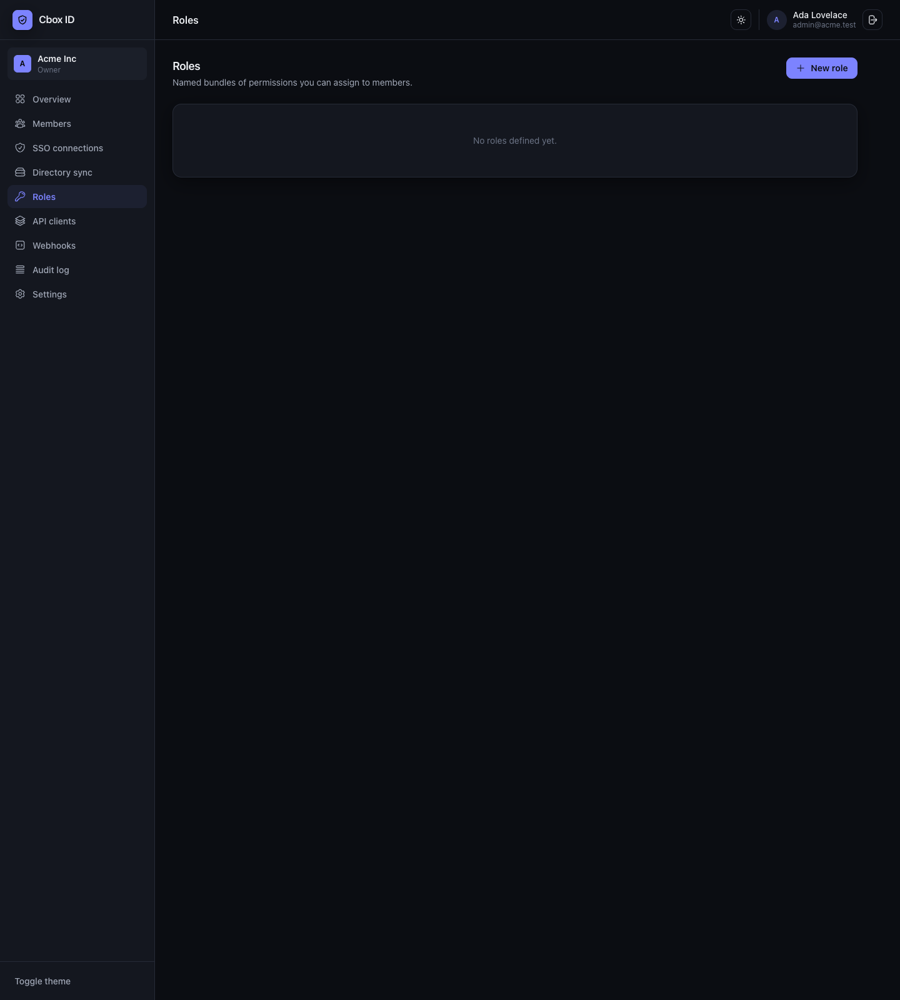

### Sign-in

*Single sign-on · Social sign-in · Sync users in · Sync users out.* Everything about how
people get in and how their accounts arrive. Enterprise SSO connects the customer's own
IdP (SAML / OIDC); social sign-in is picked from a catalogue rather than described from
memory; "sync users in" is inbound SCIM provisioning (deprovision revokes sessions
immediately) and "sync users out" pushes the same directory to downstream apps.

The two SCIM directions are named as a pair on purpose — "Directory sync" beside
"Outbound sync" gave no clue which way either moved people. The screenshots below predate
that rename.

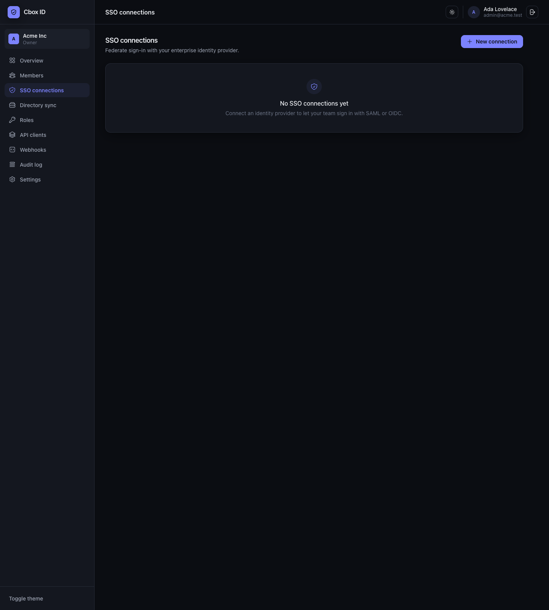
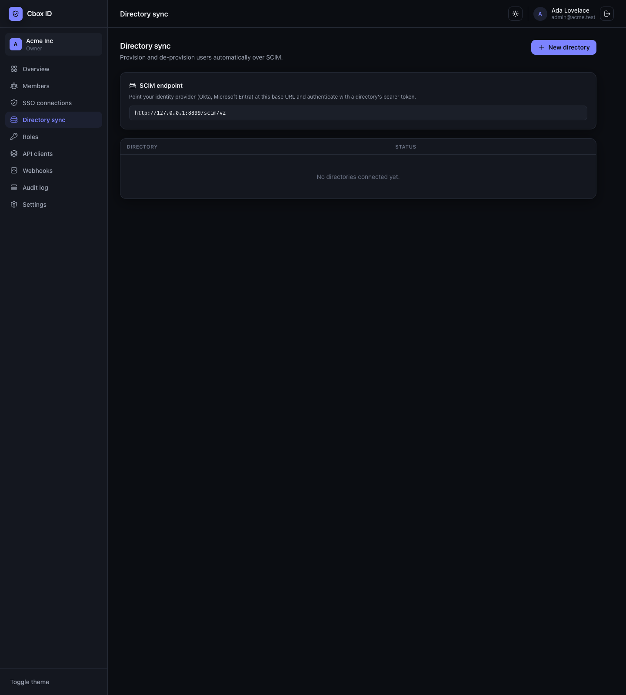

### Access control

*Access reviews · Role conflicts.* Certification campaigns — a snapshot of who holds what,
certified or revoked line by line, with the revokes applied on close — and separation-of-
duties rules that refuse a combination of roles nobody should hold at once. No screenshot.

### Developers

*Apps & API keys · Webhooks · Inline hooks · Token vault.* OAuth clients registered
against this instance (including MCP clients self-registering through Dynamic Client
Registration) and machine credentials that never sign anyone in; HMAC-signed event
delivery with retries and delivery history; synchronous inline hooks that run *during* a
flow rather than after it; and the vault holding third-party tokens.

The screenshots below are from when this area was "API clients" and "Webhooks" as two
separate top-level pages.

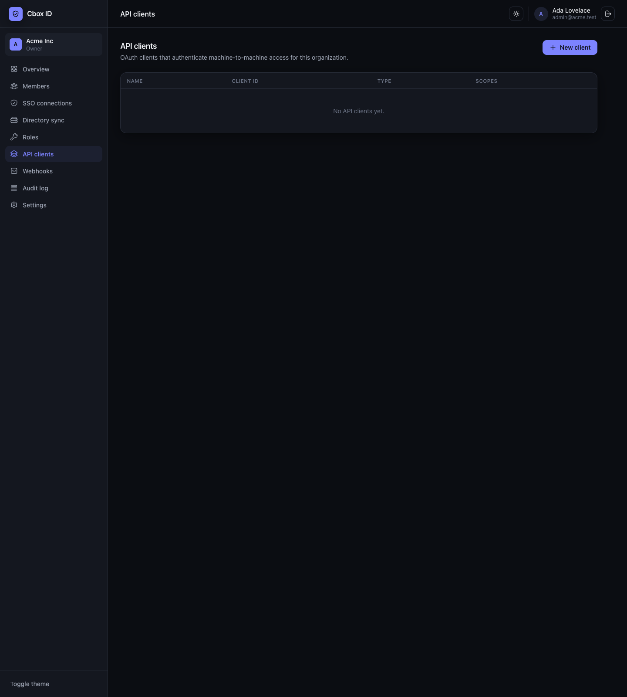
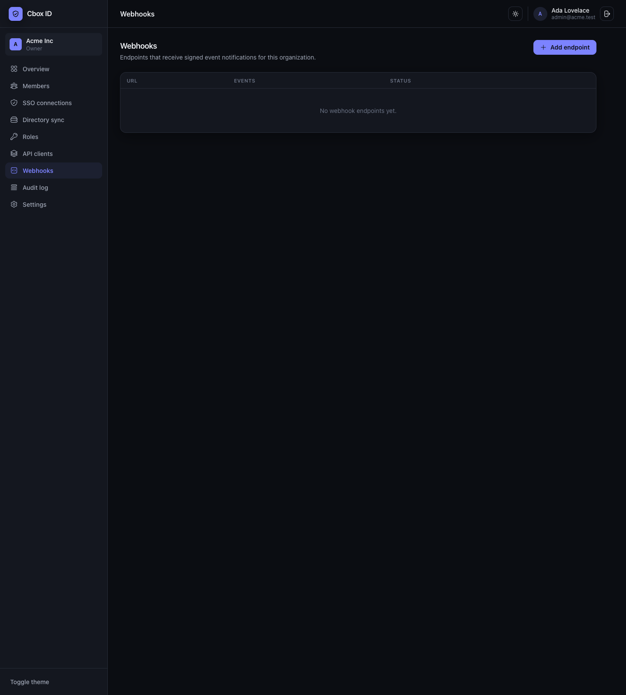

### Connectors

Third-party integrations, contributed by the connectors module rather than written into
the console. No screenshot.

### Logs

*Activity log.* The append-only, hash-chained audit trail — filterable, exportable to your
SIEM. The compliance and risk modules append their pages here rather than minting areas of
their own.

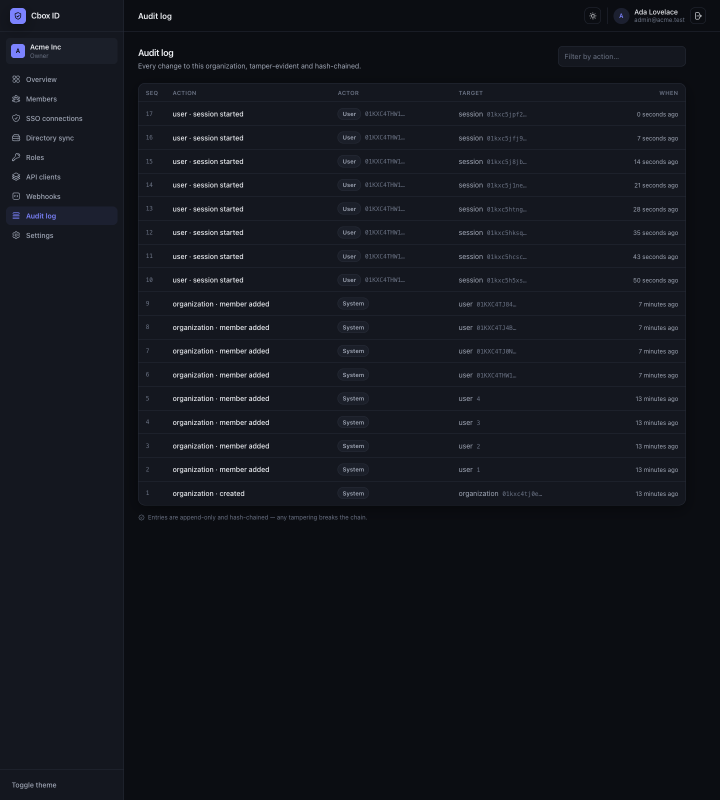

### Settings

*Settings · Appearance.* Organization details, and the branding an organization's own
sign-in page inherits.

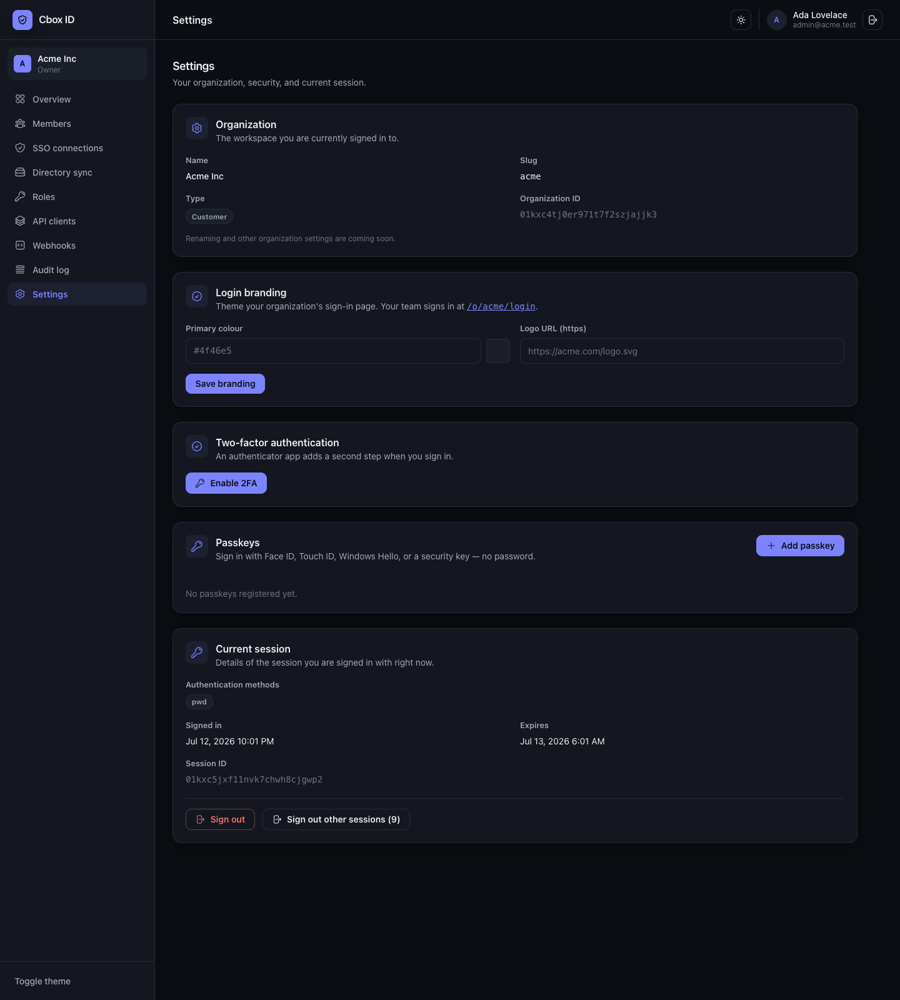

### My account

*Security.* The signed-in person's own credentials — two-factor authentication, **passkey**
enrolment, and the current session (auth methods, expiry, sign-out-everywhere). Shown to
members and admins alike; every area above is role-gated, this one is not.

It has no counterpart on the environment plane, and that is a decision rather than a gap:
an environment administrator holds the environment from the account layer, so their own
password, passkeys and sessions live in the **workspace** console instead.

No screenshot of its own — the 2026-07-13 image above filed these settings under
*Settings*, which is where they used to live.

## Chrome

### Organization switcher

A signed-in user who belongs to several organizations switches the active tenant from the
sidebar card. The switch is server-verified against membership — you can only switch into
an org you actually belong to — and the role updates with it (here: Owner in Acme, Admin in
Globex). The security model is described in
[Security](../security/_index.md#organization-switcher).

The environment plane has a second, unrelated picker beside it: which organization the
console is **acting on**. It is a search rather than a list, because an environment with
four thousand organizations is a real one.

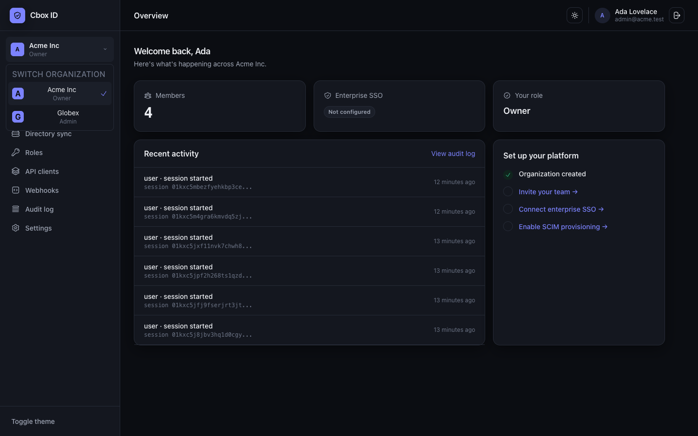

### Responsive (mobile & tablet)

Below the `lg` breakpoint the sidebar collapses into an off-canvas **navigation drawer**
(hamburger in the top bar) holding the full nav, org context, theme toggle and sign-out;
content stacks to a single column and wide tables scroll within their card. The sign-in
split-screen collapses to a centered form. Verified at phone (390px) and tablet (768px)
widths.

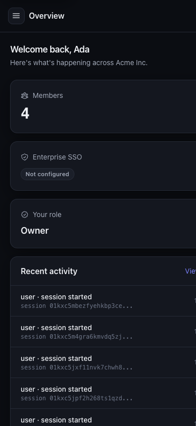

## Notes

- Inertia + React over server-rendered props, session-cookie auth, no tokens in
  the browser — chosen because this *is* the login surface. See the framework
  [security model](https://github.com/cboxdk/laravel-id/blob/main/docs/security/_index.md).
- **Accessibility:** the auth and console pages pass an automated axe-core
  WCAG 2.1 A/AA audit (guarded by a regression test); keyboard-navigable with a
  skip link, labelled landmarks and controls.
- To reproduce these locally: `php artisan migrate`, seed a demo org
  (`php artisan db:seed --class=DemoSeeder`), then sign in.
