# Screens

A tour of the Cbox ID app: the consoles and the sign-in surface. It follows the
console's own structure, with areas declared once in
[`ConsoleArea`](https://github.com/cboxdk/cbox-id/blob/main/app/Platform/Console/ConsoleArea.php)
and rendered by the same components on every console.

The screenshots are of a seeded demo environment (the "Lovelace Labs" workspace and its
"Ledger" product), taken in the light theme at 1440×900 by
`vendor/bin/pest --group=docs-screenshots`; see [Screenshots](../screenshots/_index.md) to
regenerate them. Most of them show an **environment** console, where the organization
pages appear as tabs of each organization. There is no screenshot of the Platform areas.

## Three consoles, one shell

The same shell serves three kinds of administrator. Which one you get depends on where
you signed in and what you administer:

| Console | Where | Who it is for |
|---|---|---|
| **Workspace console** | The platform root host of a hosted deployment | Your own Cbox workspace: projects, team, keys, billing |
| **Organization console** | A customer's environment host, or a single-tenant install | One organization: on a customer's host an admin portal (members, SSO, directory sync, roles, audit log); on a single-tenant install everything, apps included |
| **Environment console** | `/admin` on an environment's own host | One environment: every organization in it, their users, and the product's apps, hooks and settings |

On a hosted deployment the two are deliberately different. A customer's administrator gets
an admin portal and their own pages; the product's administration (apps, webhooks, the
token vault and the rest) is the environment console's alone, and its URLs answer 404 on
the customer's console. On a single-tenant install there is no environment console, so the
organization console keeps every page. [Workspaces &
organizations](../core-concepts/workspaces-and-organizations.md) explains the difference
between a workspace and an organization, and lists what a customer's console keeps.

A page offered by both consoles has **one URL**; the environment console's is that path
under `/admin` (`/roles` and `/admin/roles`). Old paths answer with a 301, so a bookmark
still works. [Upgrading](https://github.com/cboxdk/cbox-id/blob/main/UPGRADING.md)
lists them.

The deployment's own pages (workspaces, environments, organizations, operators) are
**platform admin**: reached from **Platform admin** in the account menu by whoever has
authority over the deployment, with a rail of their own and a strip across the top that
says so. They are no longer appended to every rail.

## The rail

The rail shows each area's icon **and its label**, by default. The pin at the top
collapses it to a strip of icons (hover it and an overlay opens with the labels); the
choice is remembered in this browser. Below the `lg` breakpoint it becomes a sheet behind
the menu button in the bottom bar.

## The topbar

Where you are on the left, search and your account on the right:

```
Acme ▾  /  Checkout ▾  /  Production ▾ [PRODUCTION]  /  All organizations ▾      Go to… ⌘K   (avatar)
```

- **Workspace ▾ / Project ▾ / Environment ▾** is one context switcher, the same on every
  console. Choosing another environment opens the same page there. The badge names the
  environment's type in words. On the workspace console no environment is current, so
  the second crumb is **Environments ▾**, every environment you may open grouped by
  project. [Workspaces &
  organizations](../core-concepts/workspaces-and-organizations.md#moving-between-them)
  describes each menu.
- **All organizations ▾** (environment console only) filters every page to one of your
  customers.
- **The avatar** opens the account menu: Workspace settings, My account, Switch user,
  Platform admin (operators), Theme, Sign out.

On a phone the context switcher moves into the navigation sheet, and the bottom bar names
the environment and its type.

Every page has a **"?"** beside its title with a short explanation, and a **Read the
guide** link to the [admin guides](../guides/_index.md) where there is one.

## Sign-in surface

### Login

Password sign-in, plus **passwordless options**: email magic link and **passkey**
(WebAuthn) sign-in. Social buttons appear when a provider is configured. Organizations
get a branded variant at `/o/{slug}/login`.

**Last used.** The method a device signed in with last time — a social provider's button,
the passkey, the magic link, or the email step for a password or single sign-on — carries a
small *Last used* badge, as on Clerk, WorkOS and Stytch. The order of the buttons does not
change. What is remembered is the method alone (`google`, `passkey`…), in a first-party,
HttpOnly cookie on the host the person signed in on; nothing about the person is stored.

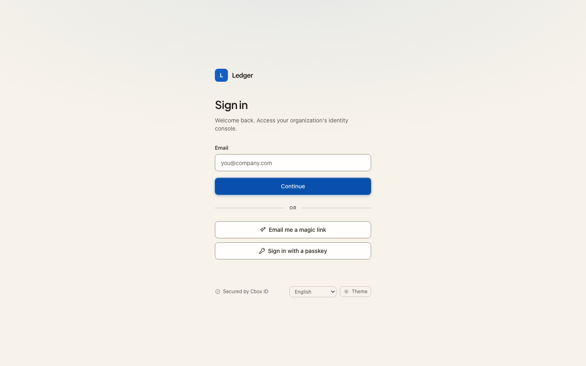

### Signup

Create a new organization and its first owner. Risk scoring runs on submit
(monitor mode by default). Availability depends on `CBOX_ID_SIGNUP_MODE` — see
[Security](../security/_index.md#self-service-signup-modes).

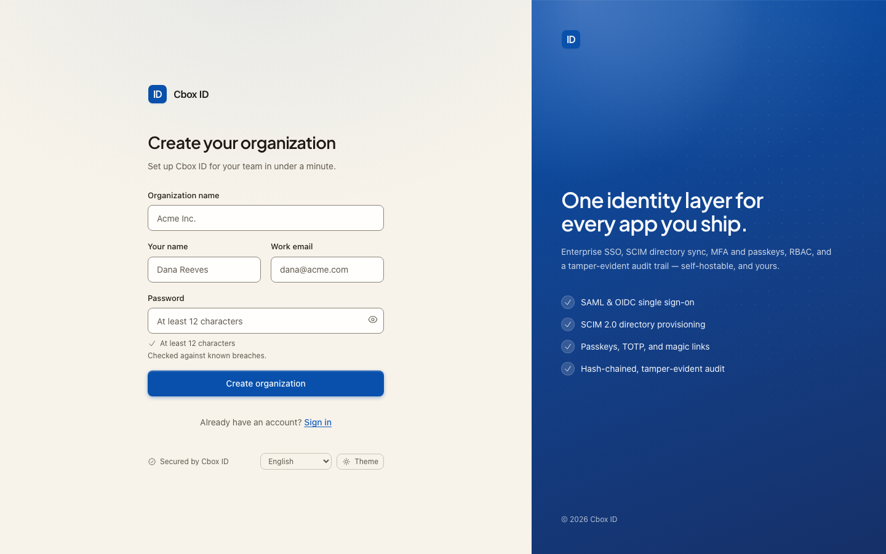

### Whose name is on the door

On the platform root the sign-in pages carry Cbox ID's own panel beside the form. On a
customer's environment every door — sign-in, sign-up, password reset, magic link, an
invitation, the organization picker and the create-a-team step — carries that
environment's brand instead: the name, **uploaded** logo and favicon its Branding page
previews, over its colours and typeface, with no Cbox ID panel. The device sign-in page and
the Admin Portal carry it too, and so do the emails. An organization's own door
(`/o/{slug}/login`) carries the organization's. The consoles on that host stay Cbox ID's.

Logos and favicons are **uploads** (PNG, JPEG or WebP; ICO for a favicon; never SVG),
served by Cbox ID itself at `/brand-assets/…`. A logo used to be an https URL to anywhere,
and every visitor's browser then reported to whoever hosted it — so a remote logo URL saved
before is no longer drawn, and the Branding page asks for an upload until one is made.
Every typeface on offer (System, Inter, Plus Jakarta Sans, Nunito, Source Serif) is
self-hosted for the same reason: no hosted page loads anything from another origin.

### Joining by invitation

The link in an invitation opens a page that says who is inviting whom, and every role
accepting will grant, in the console's words: the **built-in role** (Member, Admin, …) and
the **roles in each app** and **custom roles** the inviter ticked. A role that became
staff-only or was retired while the invitation waited is left off, because accepting would
withhold it.

## The workspace console

What a workspace member sees at the platform root of a hosted deployment. The rail is the
workspace and nothing else:

- **Workspace:** Projects, Team, Keys, Environment domains, Billing, Workspace settings.
- **Team sign-in:** Enterprise SSO, Authentication policy. How your own team signs in to
  Cbox, not how your product's users sign in.
- **Logs:** Audit log.
- **My account:** Security, Sessions & activity.

There is no Overview page and no setup guide here. The pages that administer end users
(roles, apps, webhooks and the rest) are hidden from this rail and still reachable by
URL, with a notice that says the page manages the workspace's own record in Cbox, not
your product. [Workspaces &
organizations](../core-concepts/workspaces-and-organizations.md#the-workspace-console)
explains why they are hidden rather than redirected.

After signing in, a member with exactly one environment they may administer lands in that
environment's console; everyone else lands on **Projects**, where each environment has
**Open console**.

## The organization console, area by area

The full organization console, as a single-tenant install (and an operator) sees it. On a
customer's environment host it keeps the admin portal — Members, Roles, Enterprise SSO,
Domains, Directory Sync, the Audit log, and App audit logs where the organization's plan
includes them — beside the person's own Overview, Approvals and My account; every other
page below is on the environment console instead.

### Overview

*Overview · Usage · Approvals.* The home page: member count, enterprise-SSO
status, your role, a live **recent activity** feed from the tamper-evident audit log, and
an onboarding checklist. **Approvals** is where you approve or deny a request from an app
or agent to act as you.

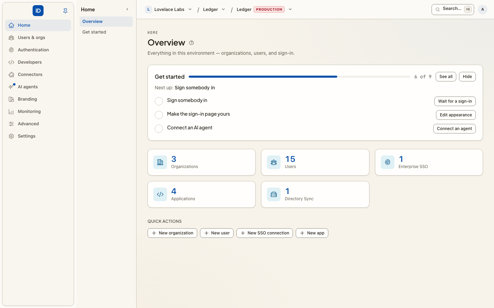
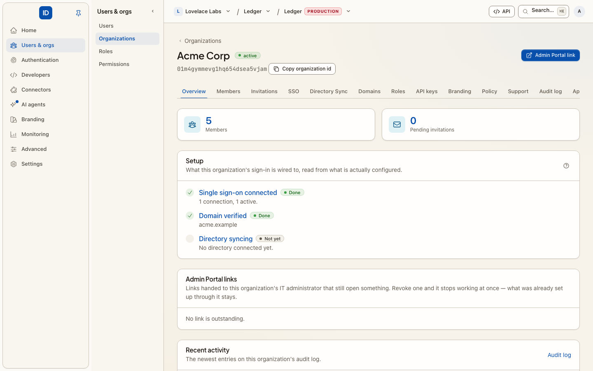

### Members & roles

*Members · Roles · Permissions · Member API keys.* The people in this organization and what they may do:
invite, change roles, remove, every change audited. Each person's **Roles** control holds
exactly one built-in role (what they may administer in the console) and any number of
roles your apps understand. The role and permission model itself is org-scoped and
hierarchy-aware.

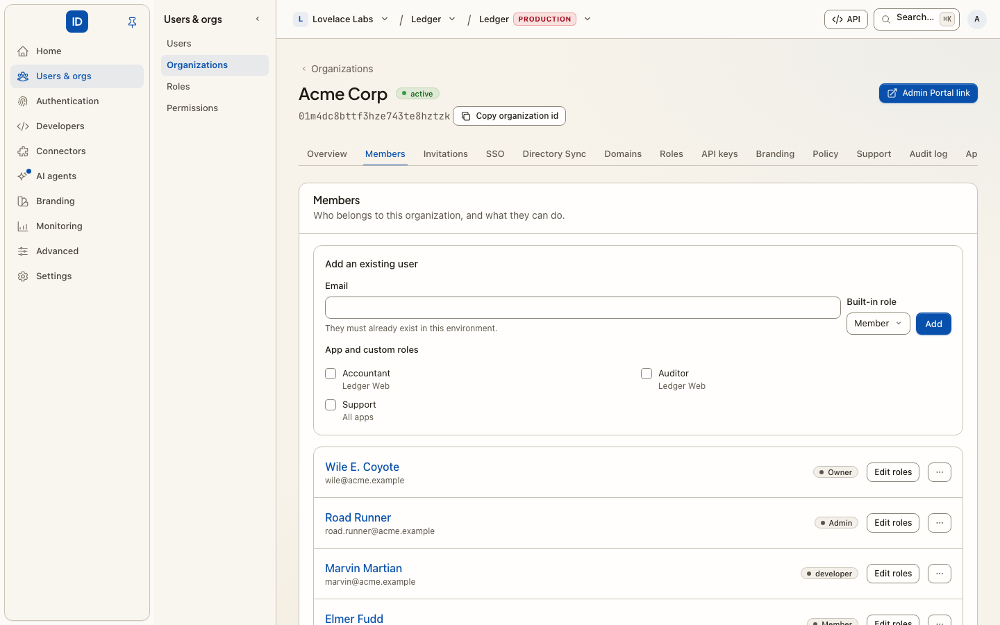
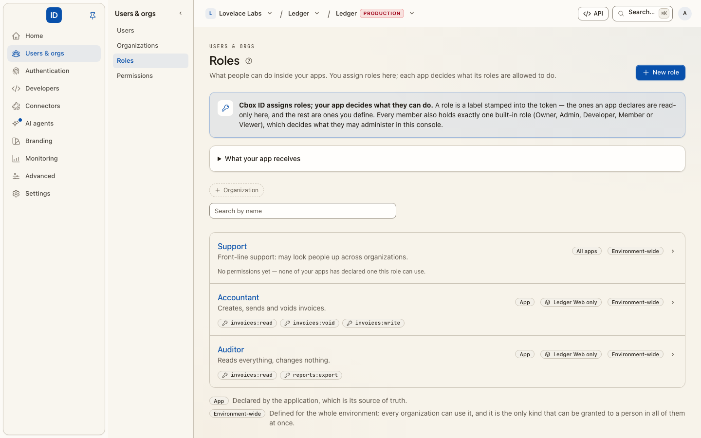

### Sign-in

*Enterprise SSO · Domains · Social login · Authentication policy · Directory Sync ·
Outbound provisioning.* Everything about how people get in and how their accounts arrive.
Enterprise SSO connects an organization's own IdP (SAML / OIDC), and **Domains** proves
the email domains that route people to it; social login is picked
from a catalogue rather than described from memory; **Authentication policy** is the
password, MFA and session policy; **Directory Sync** is inbound SCIM provisioning
(deprovision revokes sessions immediately) and **Outbound provisioning** pushes the same
directory to downstream apps.

These are the names other identity platforms use for the same pages, so somebody who has
used one finds them by the word they already know. In an environment console the same
pages are tabs of each organization.

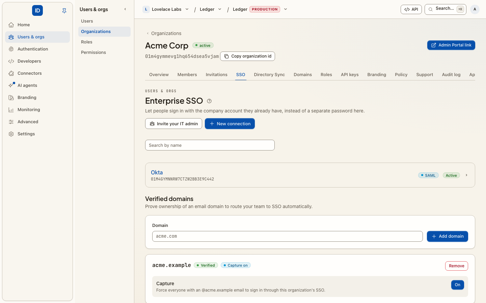
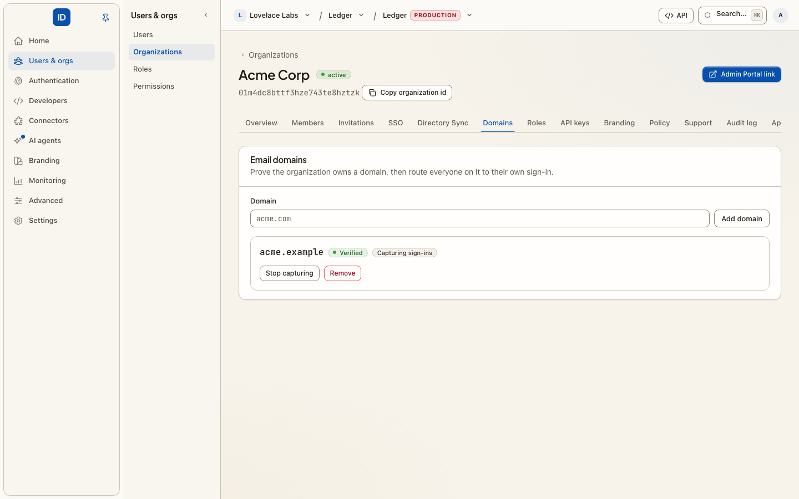


### Access control

*Access reviews · Role conflicts.* Certification campaigns (a snapshot of who holds what,
certified or revoked line by line, with the revokes applied on close) and
separation-of-duties rules that refuse a combination of roles nobody should hold at once.
No screenshot.

### Developers

*Applications · Webhooks · Hooks · Token vault.* OAuth clients registered against this
instance (including MCP clients self-registering through Dynamic Client Registration);
HMAC-signed event delivery with retries and delivery history; synchronous hooks that run
*during* a flow rather than after it; and the vault holding third-party tokens.
Machine keys are on the [API keys](../guides/keys.md) page of the workspace and
environment consoles.

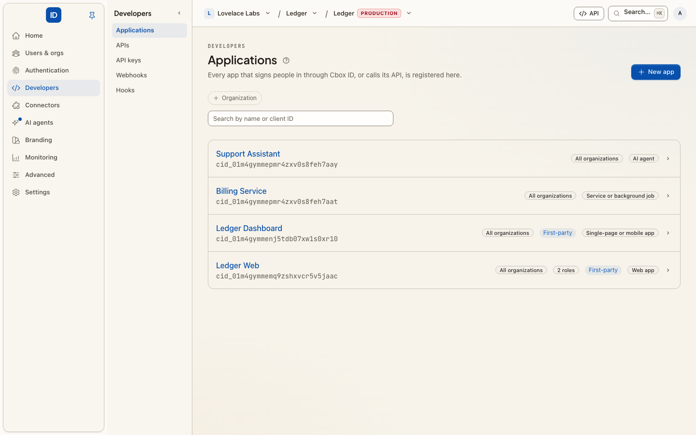
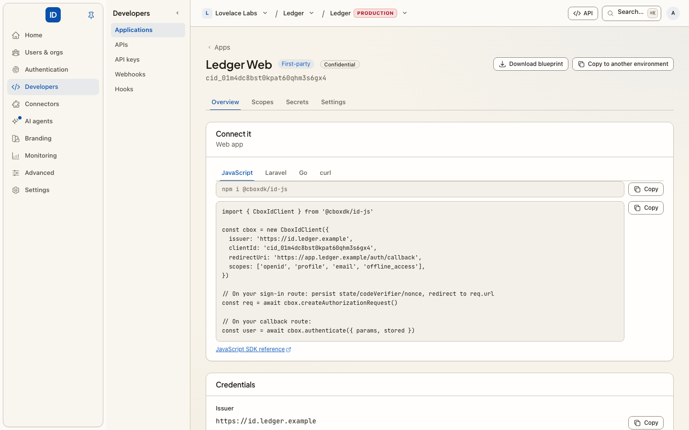


### Connectors

Third-party integrations, contributed by the connectors module rather than written into
the console. No screenshot.

### Audit log

*Audit log · App audit logs · Log streams.* The append-only, hash-chained audit trail, filterable and
exportable to your SIEM. The compliance and risk modules append their pages here rather
than minting areas of their own.

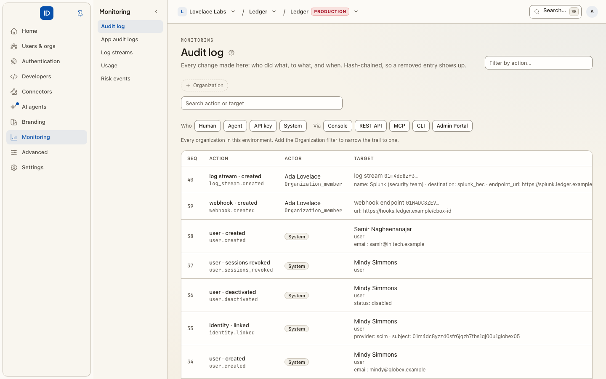

### Settings

*Settings · Branding.* Organization details, and the brand an organization's own sign-in
page inherits — one page: a preset, four colours per mode, corners, the typeface, and the
uploaded logo and favicon, edited against a live preview of the sign-in page; and, with the
white-label module, the product name, the email sender, the welcome mail and the console's
own palette. `/appearance` and the module's old Branding page redirect here.

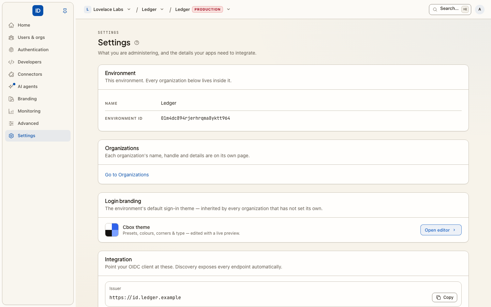

### My account

*Security · Sessions & activity · My API keys.* The signed-in person's own credentials: two-factor
authentication, **passkey** enrolment, and sessions (auth methods, expiry,
sign-out-everywhere). Shown to members and admins alike; every area above is role-gated,
this one is not.

No screenshot of its own. The 2026-07-13 image above filed these settings under
*Settings*, which is where they used to live.

## The environment console

Every capability of the full organization console, plus the ones that only make sense for
a whole environment, filed by task in the words the market uses:

- **Home:** Overview, Get started.
- **Users & orgs:** Users, Organizations (your customers). A user's page has their
  organizations, sessions, two-factor (with **Reset 2FA**), **Sign-in decisions** (what
  Radar decided about them, and why) and **Admin & support roles**: roles granted across the
  whole environment. An organization opens on its own page, `/admin/organizations/{id}`,
  with nine tabs: Overview (is SSO connected, a domain verified, a directory syncing — and
  its latest audit entries), Members (and its Invitations), SSO, Directory Sync, Domains,
  Roles, Authentication policy, Audit log (and App audit logs) and Settings (and Branding, API keys,
  Support access), plus an **Admin Portal link** for its IT administrator. The
  environment-wide lists (Enterprise SSO, Domains, Directory Sync, Roles, Audit log, …) show
  every organization's rows with an Organization column and an **Organization** filter
  chip; a form that creates something for one asks **For which organization?**.
- **Authentication:** Sign-in methods (every way in on one page — what is on and where it is
  changed), Authentication policy, Social login, Enterprise SSO, Domains, Directory Sync,
  Radar: every way people come in.
- **Authorization:** Roles, Permissions, Fine-grained authorization, Access reviews, Role
  conflicts: what people may do once they are in, and the governance of it.
- **Developers:** Applications, APIs, API keys, Webhooks, Hooks, Feature flags, Pipes.
- **AI agents:** Agents, Approvals (every pending approval request in the environment,
  so an administrator can deny one that looks like abuse), Connect.
- **Branding:** one Branding page — the sign-in theme, logo and favicon, and (with the white-label module) the name, sender and console palette.
- **Monitoring:** Audit log, Log streams, Usage, and the analytics, compliance and risk
  modules' pages.
- **Advanced:** Admins & support, Token vault, Outbound provisioning, SAML apps, Legacy
  login: set up once and rarely revisited.

Every detail page has a breadcrumb — "Authentication / Enterprise SSO" above a connection —
and ⌘K finds a page by the word you would use for it elsewhere: *SAML*, *SCIM*, *tenant*,
*Google login*, *RBAC*, *passkeys*. [Finding your way](finding-your-way.md) walks the common
tasks click by click.
- **Settings**, and **Connectors** when that module is on.

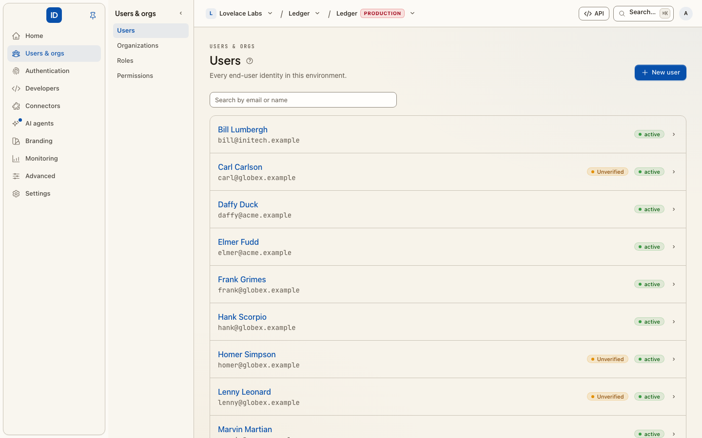
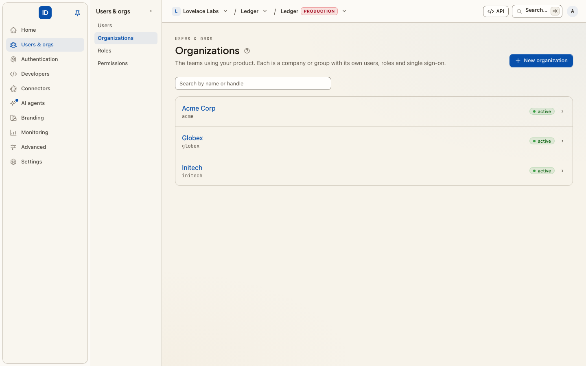

It has no My account area. Your own password, passkeys and sessions belong to your
workspace, so **My account** and **Switch user** in the account menu open on the
workspace host.

The topbar reads `<Workspace> ▾ / <Project> ▾ / <Environment> ▾ [badge] / <acting
organization> ▾`. The workspace crumb goes back to the workspace's Projects page; the
environment crumb opens the same page in another environment.

## Chrome

### Context switcher

A signed-in user who belongs to several workspaces or organizations switches from the
first crumb of the topbar. The switch is server-verified against membership (you can only
switch into one you actually belong to) and the role updates with it. The security model
is described in [Security](../security/_index.md#organization-switcher). The project and
environment crumbs list only the environments you may administer, and open them through
the same signed handoff as **Open console** on Projects.

The environment console has a second, unrelated picker after it: which organization the
console is **acting on**. It is a search rather than a list, because an environment with
four thousand organizations is a real one.

### Platform admin

For whoever runs the install, **Platform admin** in the account menu opens the platform
pages. The rail there holds only Platform, Insights and Administration, and a strip across
the top says **Platform admin** with **Exit platform admin** beside it. The topbar's old
"target environment" menu is gone; re-point the platform pages from **Platform ›
Environments**.

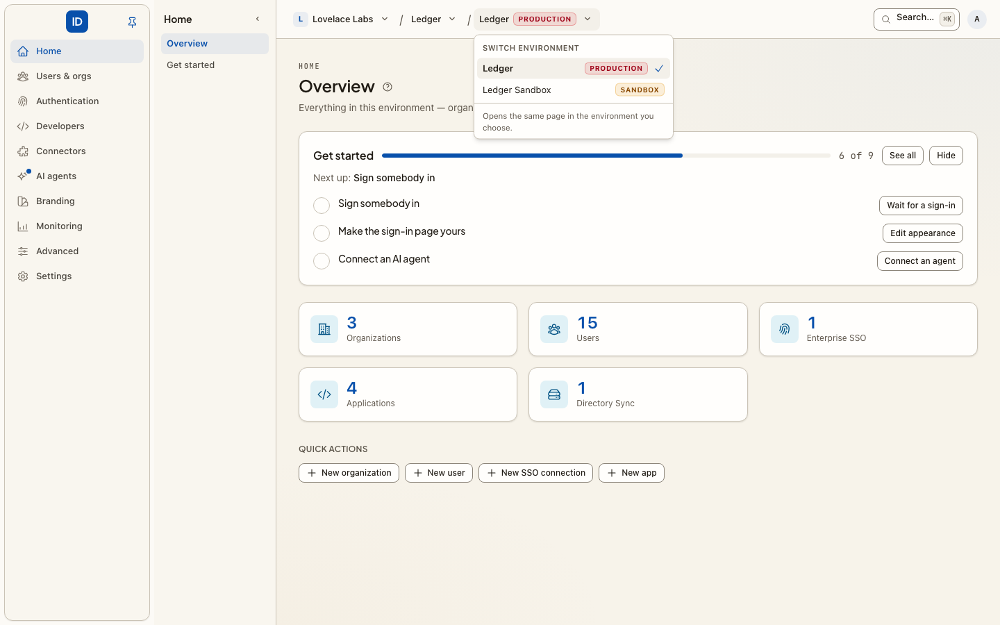

### Switch user

**Switch user** in the account menu moves between the people signed in on this device.
It does not change workspace or organization; the context switcher does that.

### Responsive (mobile & tablet)

Below the `lg` breakpoint the rail collapses into a **navigation sheet** (menu button in
the bottom bar) holding the full nav, the context switcher, the account links, theme
toggle and sign-out; content stacks to a single column and wide tables scroll within their card.
The sign-in split-screen collapses to a centered form. Verified at phone (390px) and
tablet (768px) widths.

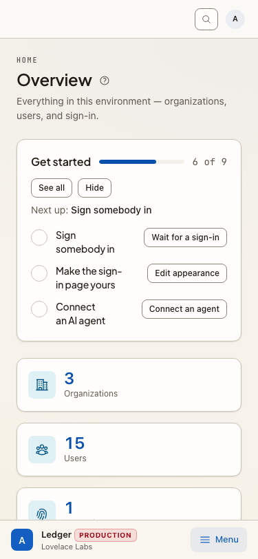

## Notes

- Inertia + React over server-rendered props, session-cookie auth, no tokens in
  the browser — chosen because this *is* the login surface. See the framework
  [security model](https://github.com/cboxdk/laravel-id/blob/main/docs/security/_index.md).
- **Accessibility:** the auth and console pages pass an automated axe-core
  WCAG 2.1 A/AA audit (guarded by a regression test); keyboard-navigable with a
  skip link, labelled landmarks and controls.
- To reproduce these locally: `php artisan migrate`, seed the demo environment
  (`php artisan db:seed --class=DemoEnvironmentSeeder`), then sign in as
  `ada@lovelace-labs.example`. The password is in the seeder.
