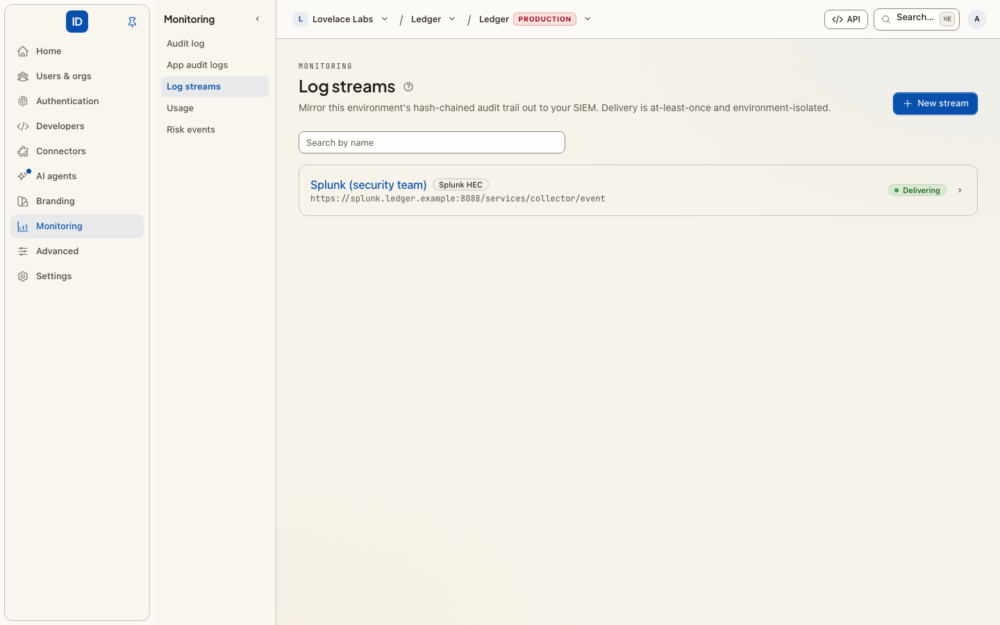

# Log streams

**Console page:** Monitoring › Log streams in an environment console, and Audit log › Log
streams in an organization's console



A log stream sends a copy of every [Audit log](activity-log.md) entry to your security
team's own tools, such as Splunk, Elastic or Datadog, or into an Amazon S3 or Google
Cloud Storage bucket for archiving, as it is written. An investigation then starts in the
tools your team already uses, not with a request for an export.

## What is sent

- **Every Audit log entry** the stream covers: sign-ins, membership changes, roles,
  connections, keys, settings. Each one carries its chain fields (`sequence`, `hash`,
  `prev_hash`) and its `organization_id`. The event's `id` is the entry's chain hash, so
  your SIEM can recognise a duplicate.
- **[App audit logs](audit-logs.md) events**, to streams an organization owns. These are
  marked `source: app`, so a SIEM can tell your app's `user.created` from Cbox ID's.

Which entries a stream gets depends on who owns it:

| Created in | Owner | Carries |
|---|---|---|
| An environment console | The environment | Every organization's entries in the environment, plus the environment's own. Not App audit logs events. |
| An organization's console, or the [Admin Portal](admin-portal.md) | That organization | That organization's entries, and its App audit logs events. Nothing from any other organization. |

An organization admin never sees the environment's own streams.

Every entry is mapped to a category (authentication, session, authorization, identity and
access, configuration, threat or audit) from its action, an outcome (failure for actions
such as `*.failed` or `*.denied`) and a severity, so your SIEM's rules have something to
match on.

## Destinations

Five destinations are **HTTP collectors**: an HTTPS `POST` of newline-delimited records
to a URL you give.

| Destination (`destination`) | Format | Default authentication |
|---|---|---|
| Splunk HEC (`splunk_hec`) | Splunk HTTP Event Collector events, `sourcetype` `cbox:siem`. A URL with no path gets `/services/collector/event`. | Splunk token |
| Elastic (ECS) (`elastic_ecs`) | Elastic Common Schema documents | Bearer token |
| Graylog (GELF) (`graylog_gelf`) | GELF over HTTP | Bearer token |
| CEF over HTTP (`cef_http`) | ArcSight CEF lines, `text/plain` | Bearer token |
| Generic JSON (`generic_json`) | One JSON object per entry: `id`, `timestamp`, `action`, `category`, `outcome`, `severity`, `actor`, `target`, `source_ip`, `message`, `context` | Bearer token |

Three are **cloud destinations**. You give their settings rather than a URL, and they
authenticate their own way:

| Destination (`destination`) | Where it goes | Credential (the stream's secret) |
|---|---|---|
| Datadog (`datadog`) | The Datadog Logs intake for your site, gzip, at most 1000 entries per request | A Datadog **API key** |
| Amazon S3 (`s3`) | One newline-delimited JSON object per batch in your bucket; also MinIO and Cloudflare R2 | A **secret access key**, or none with an assumed role |
| Google Cloud Storage (`gcs`) | One newline-delimited JSON object per batch in your bucket | A **service-account JSON key** |

A bucket receives objects named `{prefix}/{yyyy}/{mm}/{dd}/{hh}/{batch-id}.ndjson.gz`,
partitioned by the UTC hour the batch was written, one event per line. Every batch is a
new object, so a retry never overwrites one and write-only permissions are enough. Turn
**Compress** off (`"gzip": false`) for plain `.ndjson`.

There is no syslog destination; CEF over HTTP or Generic JSON reaches most collectors
that also accept syslog.

## Authentication

For the HTTP collectors:

| Scheme (`auth`) | What is sent |
|---|---|
| None (`none`) | No authentication header. |
| Bearer token (`bearer`) | `Authorization: Bearer <secret>` |
| Splunk (`splunk`) | `Authorization: Splunk <token>` |
| HMAC (`hmac`) | `X-Cbox-Timestamp: <unix time>` and `X-Cbox-Signature: t=<timestamp>,v1=<hex>`, where `v1` is HMAC-SHA256 of `timestamp + "." + body`, keyed with the stream's signing key. The same scheme as [webhooks](webhooks.md#verifying-a-delivery). |

With HMAC, leave the secret empty and a 64-character signing key is generated for you
and **shown once**. Copy it into your receiver then; only the encrypted form is stored, so
it cannot be shown again.

A token, API key, secret access key or service-account key you supply is stored
encrypted, used only to authenticate deliveries, scrubbed from any error message, and
never shown again: not on the stream's page, not on its edit form, not in an API answer.

## Create one

In the console, choose **New stream** (you are asked for your password first):

1. **Name** it, for example "Splunk — production".
2. Pick the **Destination**. The form then asks for what that destination needs.
3. For an HTTP collector, paste the **Endpoint URL** and choose the **Auth scheme**. The
   URL must be a public address: private, reserved and cloud metadata addresses are
   refused, and redirects are not followed. Paste the **Secret**, or leave it empty with
   HMAC for a generated key.
4. For Datadog, Amazon S3 or Google Cloud Storage, fill in the settings and the
   credential as described below.
5. **Create stream.** Entries flow from the next one written; earlier entries are not
   backfilled.

Then choose **Send test event** on the stream's page to check it before real entries
arrive.

### Datadog

1. In Datadog, go to **Organization Settings › API Keys › New Key**. Use an *API key*,
   not an application key.
2. Choose the **Datadog site** your account is on: the domain of the Datadog URL you sign
   in at. That is `datadoghq.com` (US1), `us3.datadoghq.com`, `us5.datadoghq.com`,
   `datadoghq.eu` (EU1), `ap1.datadoghq.com`, `ap2.datadoghq.com` or `ddog-gov.com`
   (US1-FED). A key only works on its own site.
3. Paste the key as the **API key**.
4. Optionally set **Service** (default: this platform's name), **Source** (`ddsource`,
   default `cbox`), **Tags** (`key:value`, comma-separated, for example
   `env:prod, team:security`) and **Hostname**.

Each entry arrives as one log whose message is the event's JSON, which Datadog parses into
attributes.

### Amazon S3

1. Create the bucket, with your own retention and lifecycle rules.
2. Create this **permissions policy**. It allows writing objects under the prefix and
   nothing else: nothing can be read, listed or deleted. The stream's page shows it filled
   in for your bucket and prefix, with a copy button.

   ```json
   {
     "Version": "2012-10-17",
     "Statement": [
       {
         "Sid": "CboxAuditWriteOnly",
         "Effect": "Allow",
         "Action": "s3:PutObject",
         "Resource": "arn:aws:s3:::acme-audit-logs/cbox/audit/*"
       }
     ]
   }
   ```

   With **SSE-KMS** on a customer-managed key, add a statement allowing
   `kms:GenerateDataKey` on the key's ARN.
3. Choose the **Credentials**:
   - **Access key**: attach the policy to an IAM user, create an access key for it, and
     give its **Access key ID** and **Secret access key**.
   - **Assume an IAM role**: no secret is stored with us. Attach the policy to a role,
     give its **IAM role ARN**, and create the stream. Then set the role's **trust
     policy** to the one the stream's page shows. It names this platform's AWS principal
     and requires the stream's **external ID**, a value generated for this stream alone:

     ```json
     {
       "Version": "2012-10-17",
       "Statement": [
         {
           "Effect": "Allow",
           "Principal": { "AWS": "arn:aws:iam::<platform-account-id>:user/<platform-user>" },
           "Action": "sts:AssumeRole",
           "Condition": { "StringEquals": { "sts:ExternalId": "<the stream's external ID>" } }
         }
       ]
     }
     ```

     The external ID is what stops another customer of this platform from pointing a
     stream at your role. Nothing is written to the bucket until the trust policy is in
     place; send a test event once it is. This option is offered only when the operator
     has given the platform an AWS identity
     ([environment variables](../configuration/environment-variables.md#log-streams-siem)).
4. Give the **Bucket**, its **AWS Region** (for example `eu-west-1`), and optionally a
   **Prefix** and **Server-side encryption** (`AES256`, or `aws:kms` with a KMS key).

For **MinIO** or **Cloudflare R2**, set the **Custom endpoint** to the store's `https://`
address (R2's region is `auto`). A custom endpoint uses path-style addressing.

### Google Cloud Storage

1. Create the bucket, then a **service account** for this platform.
2. Grant the service account **Storage Object Creator** (`roles/storage.objectCreator`)
   on the bucket only. It can create objects and nothing else:

   ```bash
   gcloud storage buckets add-iam-policy-binding gs://acme-audit-logs \
     --member="serviceAccount:cbox-audit@acme-project.iam.gserviceaccount.com" \
     --role="roles/storage.objectCreator"
   ```

3. Create a **JSON key** for the service account and paste the whole file as the
   **Service account key**.
4. Give the **Bucket** and optionally a **Prefix**.

The key signs a short-lived token request to Google's token endpoint. The key file's own
`token_uri` is ignored, so a key file cannot change where the platform sends requests.

## Delivery

- **At least once.** Each entry is written to an outbox in the same transaction as the
  Audit log entry itself, then delivered. A retry after a timeout can deliver an entry
  twice; deduplicate on `id`.
- **Batched.** A scheduled pump runs every minute and sends up to 500 records, or 512 KB,
  per request (Datadog: never more than its intake accepts).
- **Retried.** A failed batch is retried with exponential backoff and jitter, up to 12
  attempts, about two and a half hours in all. After that the entries are dead-lettered and not retried.
- **Circuit-broken, not disabled.** After 5 consecutive failures the stream is skipped
  for 5 minutes, then one probe is tried. A refused credential or setting opens the
  circuit at once and the entries wait without using up their attempts (see below). The
  stream is never switched off for you.
- **Bounded.** A stream holds at most 100,000 pending entries. Beyond that the oldest
  are dropped by default, so a receiver that is down for days does not grow the outbox
  forever.

The operator of the deployment can change these limits; see
[the framework's audit streaming guide](https://github.com/cboxdk/laravel-id/blob/main/docs/core-concepts/audit-streaming.md).
Delivery needs the scheduler and a queue worker running.

## Health and testing

Each stream shows how delivery is going:

| Status (`health`) | Meaning | What to do |
|---|---|---|
| Delivering (`healthy`) | The last attempt succeeded, or none has failed. | Nothing. |
| Retrying (`degraded`) | Recent failures that may pass: a timeout, `429`, a `5xx`. Still retrying. | Usually nothing. |
| Paused after failures (`paused`) | 5 failures in a row; the stream is skipped for 5 minutes, then tried again. | Check the destination is up. |
| Action required (`action_required`) | The destination refused the credential or the settings: `401`/`403`, a missing bucket, a wrong region, a refused token exchange. | Fix the stream. Entries wait, without using up their attempts. |

The stream's page shows the **last error**, scrubbed of the credential. **Edit** the
stream to replace a key or correct a setting: saving checks the settings again and
retries delivery on the next run. A successful **Send test event** also clears
**Action required**.

**Send test event** sends one marked event (action `siem.stream.test`, "safe to
ignore") straight to the destination, with the stream's own format and credential. It
does not go through the outbox and is not retried. The page says whether it was accepted,
or gives the destination's reason.

## Edit, disable, resume, delete

- **Edit** changes the name, the destination, its settings or the credential, behind
  your password like creating. The credential field starts empty, and empty keeps the
  current one. An assumed-role stream keeps its external ID when you edit it.
- **Disable stream** stops delivery and **keeps** what is pending. **Resume** sends it
  with the next batch, so nothing is lost while it was off. Disabling is critical:
  it is how a trail goes dark.
- **Delete stream** stops delivery at once and destroys the stored credential. The Audit
  log itself is untouched.

Each change is recorded on the Audit log as `log_stream.created`, `log_stream.updated`,
`log_stream.disabled`, `log_stream.enabled` or `log_stream.deleted`, with the destination
and its settings but never a credential. `log_stream.updated` lists which fields changed,
`secret` among them when the credential was replaced.

## From code

The same lifecycle is a set of [actions](../core-concepts/actions.md), on the management
API, MCP and the CLI alike:

| Action | REST | Scope | Danger |
|---|---|---|---|
| `log_streams.list`, `log_streams.get` | `GET /api/v1/log-streams`, `…/{id}` | `log_streams:read` | read |
| `log_streams.create` | `POST /api/v1/log-streams` | `log_streams:write` | critical |
| `log_streams.update` | `PATCH /api/v1/log-streams/{id}` | `log_streams:write` | critical |
| `log_streams.test` | `POST /api/v1/log-streams/{id}/test` | `log_streams:write` | write |
| `log_streams.delete` | `DELETE /api/v1/log-streams/{id}` | `log_streams:write` | destructive |

`log_streams.create` takes `name`, `destination`, either `organization_id` or
`"environment_wide": true`, and:

- for an HTTP collector, `endpoint_url`, and optionally `auth` and `secret`;
- for Datadog, S3 and GCS, `secret` (the API key, secret access key or service-account
  JSON key; none for an assumed role) and `options`: Datadog `site`, `service`, `source`,
  `tags` (a list), `hostname`; S3 `bucket`, `region`, `prefix`, `access_key_id` **or**
  `role_arn`, `sse`, `kms_key_id`, `path_style`, `gzip`; GCS `bucket`, `prefix`, `gzip`.
  Leave out `endpoint_url` for the destination's own endpoint, or give an `https` URL for
  an S3-compatible store.

```json
{
  "name": "Audit archive",
  "destination": "s3",
  "options": {
    "bucket": "acme-audit-logs",
    "region": "eu-west-1",
    "prefix": "cbox/audit",
    "role_arn": "arn:aws:iam::123456789012:role/cbox-audit-writer"
  },
  "environment_wide": true
}
```

The answer carries `secret` only when the platform generated it (an HMAC key), and
`external_id` for an assumed-role S3 stream: put it in the role's trust policy. A setting
the destination does not accept is refused with `invalid_stream_configuration` and a
message naming the field; a role when the platform has no AWS identity, with
`assumed_role_unavailable`. Every stream also answers its `options`, `health`,
`last_error`, `last_failure_kind` and `last_failure_at`.

`log_streams.update` takes any of `name`, `destination`, `endpoint_url`, `auth`,
`secret`, `options` and `enabled` (`false` to disable, `true` to resume). `options` are
merged over the stored ones: send only what changes, and `null` to remove a key, such as
`access_key_id` when moving to a `role_arn`. Changing the destination starts its options
and credential afresh. Any change to the settings is checked again and resets the
stream's failure count.

`log_streams.test` sends one test event (`siem.stream.test`) straight to the destination
and answers `{ "delivered": true|false, "failure": …, "error": … }`, where `failure` is
`transient`, `authentication` or `configuration`. It is not retried and does not go
through the outbox.

Creating and updating a stream are critical, so a key with an approval policy may wait for
a person first ([step-up approvals](step-up-approvals.md)).

## Related

- [Audit log](activity-log.md) — what is being streamed.
- [App audit logs](audit-logs.md) — your app's own events, which organization-owned streams also carry.
- [Admin Portal](admin-portal.md) — let a customer's IT admin point their organization's entries at their own SIEM or bucket.
- [Log streams, for IT admins](../for-it-admins/log-streams.md) — what that IT admin sees.
- [Environment variables](../configuration/environment-variables.md#log-streams-siem) — the platform's AWS identity for assumed-role S3 streams.
- [Webhooks](webhooks.md) — notifications for your systems to react to, rather than a record.
