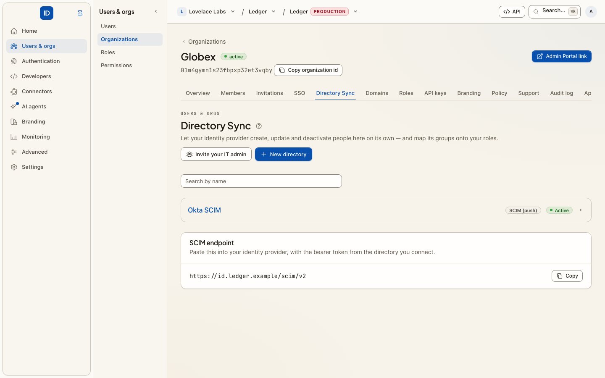

# Directory Sync

**Console page:** Sign-in › Directory Sync (Authentication › Directory Sync in an environment console)

With Directory Sync, your identity provider — not you — decides who exists here.
It creates people when they join, updates them when their details change, and
deactivates them when they leave, over a standard called **SCIM 2.0**.

[Enterprise SSO](single-sign-on.md) and Directory Sync solve different halves of the same
problem. SSO answers *"is this really them?"* at the moment they sign in. Directory Sync
answers *"should this person exist at all?"* continuously — which is what closes
the gap where a leaver still has a working account somewhere because no one filed a
ticket.

## Two ways to connect

**Cbox ID pulls** — for Google Workspace and Microsoft Entra, connect the directory
directly on the page with admin credentials. Cbox ID reads users and groups **hourly**,
via `cbox-id:directory:sync`, which is scheduled for you — so this needs the platform's
scheduler to be running (`php artisan schedule:work`, or a cron entry calling
`schedule:run`). Without it a directory syncs once, when you connect it, and never again.
Nothing to configure on the provider side beyond consent.

**Your provider pushes** — for Okta, OneLogin, or anything else that speaks SCIM.
Register a directory here to get a bearer token, then point your provider at the
SCIM base URL shown on the page (`/scim/v2` on your Cbox ID host) and authenticate
with that token.

## Before you start

- Directory Sync is an Enterprise feature. If the page says so instead of showing the
  directories, the organization's plan does not include it yet.
- If somebody else administers the identity provider, you do not have to collect their
  admin credentials. Send them an [Admin Portal](admin-portal.md) link that covers
  Directory Sync: they create the directory and paste the token into their provider
  themselves, without an account here.

## Set it up

1. Choose **New directory**, pick the **Provider**, and give it a **Directory name**
   (what your team calls it, for example "Okta"). For Google Workspace, paste the
   **Service-account JSON key** and the **Admin email to impersonate**; for Microsoft
   Entra, the **Tenant ID**, **Client ID** and **Client secret**. Those credentials are
   checked against the provider before anything is stored. The bearer token is
   For a SCIM directory, the bearer token is shown **once**: store it in your provider
   immediately.
2. In your provider, assign the people and groups that should have access. Only
   what you assign is sent; a SCIM connection does not mean "everyone in the
   company" unless you scope it that way.
3. Watch the first sync land. Directories show as **Active** or **Paused**, with the
   last error if one occurred.
4. Map the groups your provider sends onto your [roles](roles.md). This is the part
   worth doing carefully: once `Engineering` maps to a role, access follows group
   membership, and you stop granting anything by hand.

## From code

Every step is an [action](../core-concepts/actions.md), on the management API, MCP and the
CLI alike:

| Action | REST | Scope | Danger |
|---|---|---|---|
| `directories.list`, `directories.get` | `GET /api/v1/directories`, `GET /api/v1/directories/{id}` | `directory_sync:read` | read |
| `directories.create` (a SCIM directory) | `POST /api/v1/directories` | `directory_sync:write` | critical |
| `directories.connect` (Google Workspace or Entra) | `POST /api/v1/directories/connect` | `directory_sync:write` | critical |
| `directories.update` | `PATCH /api/v1/directories/{id}` | `directory_sync:write` | write |
| `directories.status.set` (pause or resume) | `POST /api/v1/directories/{id}/status` | `directory_sync:write` | write |
| `directories.token.rotate` | `POST /api/v1/directories/{id}/rotate` | `directory_sync:write` | critical |
| `directories.groups.list` | `GET /api/v1/directories/{id}/groups` | `directory_sync:read` | read |
| `directories.groups.map` | `POST /api/v1/directories/{id}/group-roles` | `directory_sync:write` | write |
| `directories.delete` | `DELETE /api/v1/directories/{id}` | `directory_sync:write` | destructive |

The critical ones mint or replace a credential, so a key with an approval policy may wait
for a person first ([step-up approvals](step-up-approvals.md)).

**Rotate bearer token** issues a fresh token and the old one stops working at once, so
update your provider right after. **Delete directory** stops provisioning and removes
the group mappings; the people it created stay.

## Things worth knowing

- **Deactivation is the point.** Confirm that deactivating a test user in your
  provider deactivates them here. If it does not, your provider is probably not
  configured to send deactivations, and the whole arrangement is only doing half
  its job.
- **The token is a credential.** Anyone holding it can create and deactivate people
  in your organization. Rotate it if it has ever been in a chat message or a ticket.
- **Group mapping is push-based.** Everyone in a mapped group gets the role; remove
  the mapping and the grant goes with it.

## Troubleshooting

**Nothing appears after connecting** — nobody is assigned to the application in your
provider. Assign users or groups there first.

**"Could not connect … check the credentials and admin consent"** — the service
account or app registration lacks directory read permission, or admin consent was
never granted in the provider.

**Someone was created but has no access** — creating a person is not granting them
anything. Map their group onto a role, or assign one on the Members page.

## Related

- [Enterprise SSO](single-sign-on.md) — signing in the people Directory Sync creates.
- [Admin Portal](admin-portal.md) — let the customer's IT admin connect their directory.
- [Directory Sync, for IT admins](../for-it-admins/directory-sync.md) — what that IT admin is shown.
- [Outbound provisioning](sync-users-out.md) — the same idea in the other direction.
- [Roles](roles.md) — what group mappings actually grant.
- [SCIM in the framework](https://github.com/cboxdk/laravel-id/blob/main/docs/core-concepts/scim.md) — the protocol details.
