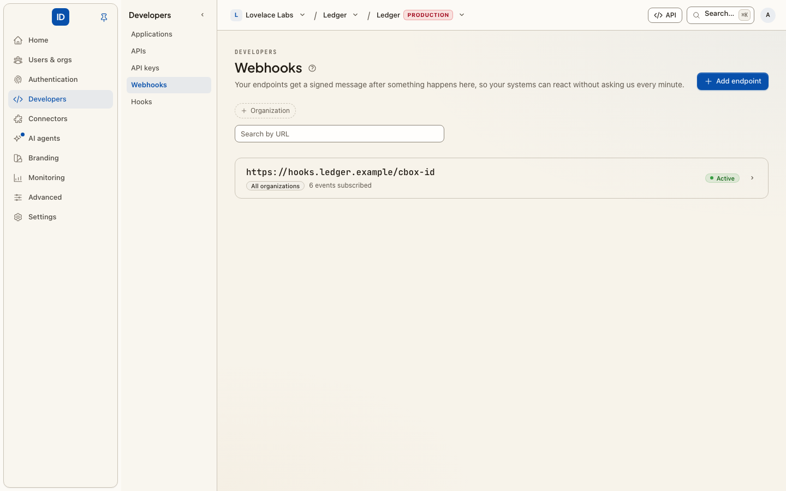

# Webhooks

**Console page:** Developers › Webhooks, in an organization's console and in an environment console



A webhook endpoint is a URL of yours that Cbox ID posts to **after** something
happens: a member was added, a user signed in, a directory deactivated somebody.
Your systems find out as it happens instead of polling, and — importantly — a
webhook is a notification, not a vote. Your endpoint is told; it cannot hold
anything up or refuse. If you need a say in the outcome, you want a
[hook](inline-hooks.md) instead.

## Events you can subscribe to

The picker lists every event Cbox ID sends. The list comes from the catalogue in
`cboxdk/laravel-id` ([webhook events reference](https://github.com/cboxdk/laravel-id/blob/main/docs/reference/webhook-events.md)).
Common ones:

| Event | Fires when |
| --- | --- |
| `user.created` | A person is created in this organization |
| `user.login` | A person signs in |
| `identity.linked` | An external identity is linked to a person |
| `membership.created` | Someone joins the organization |
| `membership.updated` | A member's role changes, including an ownership transfer |
| `membership.deleted` | Someone is removed from it, or leaves |
| `invitation.created` / `invitation.accepted` / `invitation.revoked` | An invitation's lifecycle |
| `organization.deleted` | The organization is closed |
| `directory.user.provisioned` | A directory sync created or updated a person |
| `directory.user.deactivated` | A directory sync deactivated a person |

**Older names.** `organization.member_added`, `organization.member_removed` and the other
`organization.member_*` and `organization.invitation_*` events are still sent to endpoints
that subscribe to them. They are no longer offered for new endpoints. An endpoint
subscribed to `*` receives both names for the same change, so count on one family only.

## Set one up

1. **Add endpoint**, give it your HTTPS URL, pick a [signature scheme](#signature-schemes),
   and tick the events it should receive.
2. Copy the **signing secret**. It is shown once.
3. Verify every delivery against that secret before acting on it (below).
4. Make something happen that the endpoint subscribes to, such as inviting a test
   member, and confirm the delivery arrives and verifies before you rely on it. There is
   no "send test event" button.

An endpoint in an organization's console carries that organization's events only. One
created in an environment console can instead be **environment-wide**, carrying every
organization's events, which is why the API makes you say which you mean.

From your backend or an agent, the same lifecycle is a set of [actions](../core-concepts/actions.md),
on the management API, MCP and the CLI alike:

| Action | REST | Scope | Danger |
|---|---|---|---|
| `webhooks.list`, `webhooks.get` | `GET /api/v1/webhooks`, `GET /api/v1/webhooks/{id}` | `webhooks:read` | read |
| `webhooks.create` | `POST /api/v1/webhooks` | `webhooks:write` | critical |
| `webhooks.update` | `PATCH /api/v1/webhooks/{id}` | `webhooks:write` | write |
| `webhooks.pause`, `webhooks.resume` | `POST /api/v1/webhooks/{id}/pause`, `…/resume` | `webhooks:write` | write |
| `webhooks.secret.rotate` | `POST /api/v1/webhooks/{id}/rotate` | `webhooks:write` | critical |
| `webhooks.signature_scheme.change` | `POST /api/v1/webhooks/{id}/signature-scheme` | `webhooks:write` | destructive |
| `webhooks.delete` | `DELETE /api/v1/webhooks/{id}` | `webhooks:write` | destructive |

`webhooks.create` takes `url`, `event_types`, an optional `signature_scheme` (`cbox`, the
default, or `standard_webhooks`, see [signature schemes](#signature-schemes)) and either
`organization_id` or `"environment_wide": true`, never neither. Its answer carries the signing secret once;
`webhooks.secret.rotate` issues a new one the same way. Creating an endpoint and rotating
its secret are critical, so a key with an approval policy may have to wait for a person
([step-up approvals](step-up-approvals.md)). Every change, from the console or the API, is
on the [audit log](activity-log.md) as `webhook.*`, naming who made it. See
[the management API](../getting-started/management-api.md#webhooks-hooks-log-streams-and-the-trail).

**Pause** an endpoint to stop deliveries while you work on the receiver without losing
its configuration; **Resume** picks up again.

Can't accept inbound requests? Poll `GET /api/v1/events?after=<last id>` (`events:read`)
for the same events instead.

## Signature schemes

Every delivery is signed with HMAC-SHA256 and the endpoint's secret. Each endpoint picks
how, when you create it (**Signature scheme** on the form, `signature_scheme` on the API):

| | Cbox (`cbox`, the default) | Standard Webhooks (`standard_webhooks`) |
|---|---|---|
| Choose it when | your receiver already verifies `X-Cbox-Signature`, or uses a Cbox ID SDK | your receiver uses a [Standard Webhooks](https://www.standardwebhooks.com/) library, or a platform that verifies Standard Webhooks itself |
| Headers | `X-Cbox-Timestamp`, `X-Cbox-Signature: t=<ts>,v1=<hex>` | `webhook-id`, `webhook-timestamp`, `webhook-signature: v1,<base64>` |
| Signed string | `{timestamp}.{raw body}` | `{webhook-id}.{timestamp}.{raw body}` |
| Secret | 64 hex characters | `whsec_` followed by base64 |
| HMAC key | the secret string, as written | the base64-decoded bytes after `whsec_` |
| Signature encoding | lowercase hex | base64 |

A delivery carries only its own scheme's headers. The body is the same JSON envelope
either way: `type`, `sequence`, `data` and `delivery_id`. Under Standard Webhooks,
`webhook-id` is the delivery id. It stays the same on every retry, so dedupe on it.

For a new receiver with nothing built yet, Standard Webhooks is the easier choice:
there is a ready-made library in most languages, and the message id arrives signed in a
header.

### Changing an endpoint's scheme

On the endpoint's page, **Signature scheme** › **Change scheme**, or
`POST /api/v1/webhooks/{id}/signature-scheme` with `{"signature_scheme": "standard_webhooks"}`.

**No new secret is issued, and none is shown.** The secret you already hold works under
either scheme:

- **Cbox → Standard Webhooks:** your hex secret becomes `"whsec_" + base64(hexSecret)`.
  Base64-encode the 64-character hex string itself, not the bytes it spells. In PHP that
  is `'whsec_'.base64_encode($hexSecret)`.
- **Standard Webhooks → Cbox:** the whole `whsec_…` string, prefix included, is the Cbox
  HMAC key as written.

**Update your receiver first.** The change applies from the next attempt, retries
included. A receiver still verifying the old headers rejects every delivery until it is
updated. Rejected deliveries are retried, but one that runs out of retries is lost. That
is why the console asks you to type the endpoint's URL to confirm, and why the action is
**destructive** even though you can switch back.

Rotating the secret mints it in the endpoint's current scheme: 64 hex characters under
Cbox, a `whsec_` secret under Standard Webhooks.

## Verifying a delivery

Whichever scheme you use:

1. Read the **raw** body, before any JSON parsing or framework normalisation. A
   re-encoded body never verifies.
2. Recompute the HMAC and compare with a constant-time comparison.
3. Reject a timestamp outside a tolerance window (five minutes is usual), in both
   directions. This stops a captured delivery being replayed at you later.
4. Answer `4xx` to anything that fails. The delivery is retried.

### Standard Webhooks

Any Standard Webhooks library verifies these deliveries with the `whsec_` secret exactly
as it was shown.

**Node**

```javascript
import { Webhook } from "standardwebhooks";

const wh = new Webhook(process.env.CBOX_ID_WEBHOOK_SECRET); // "whsec_…"

// rawBody: the request body as a string or Buffer, untouched.
// headers: an object with webhook-id, webhook-timestamp and webhook-signature.
const event = wh.verify(rawBody, headers); // throws if it does not verify
```

**PHP** (in a Laravel app with `cboxdk/laravel-id` installed, the framework ships the verifier)

```php
use Cbox\Id\Webhooks\Exceptions\InvalidWebhookSignature;
use Cbox\Id\Webhooks\Support\StandardWebhookSignature;

try {
    StandardWebhookSignature::verify(
        $request->getContent(),          // the raw body
        $request->headers->all(),
        config('services.cbox_id.webhook_secret'), // "whsec_…"
    );
} catch (InvalidWebhookSignature $e) {
    return response('', 400);            // $e->reason says why
}
```

Without the framework, use the Standard Webhooks library for PHP, or compute it yourself:
base64-decode the secret after `whsec_`, HMAC-SHA256 `"{webhook-id}.{webhook-timestamp}.{raw body}"`
with those bytes, base64-encode the result, and compare it in constant time with each
space-separated `v1,<signature>` entry of `webhook-signature`.

**Python**

```python
from standardwebhooks.webhooks import Webhook

wh = Webhook(os.environ["CBOX_ID_WEBHOOK_SECRET"])  # "whsec_…"
event = wh.verify(raw_body, headers)  # raises if it does not verify
```

### Cbox

`v1` is the hex HMAC-SHA256 of `timestamp + "." + raw body`, keyed with the secret string
as written.

**Node**

```javascript
import { createHmac, timingSafeEqual } from "node:crypto";

function verifyCbox(rawBody, header, secret, toleranceSeconds = 300) {
  const parts = Object.fromEntries(header.split(",").map((p) => p.split("=", 2)));
  const timestamp = Number(parts.t);
  if (!Number.isInteger(timestamp) || Math.abs(Date.now() / 1000 - timestamp) > toleranceSeconds) {
    return false;
  }
  const expected = createHmac("sha256", secret).update(`${timestamp}.${rawBody}`).digest("hex");
  const given = Buffer.from(parts.v1 ?? "", "utf8");
  return given.length === expected.length && timingSafeEqual(given, Buffer.from(expected, "utf8"));
}

// verifyCbox(rawBody, req.headers["x-cbox-signature"], process.env.CBOX_ID_WEBHOOK_SECRET)
```

**PHP**

```php
use Cbox\Id\Webhooks\Support\CboxWebhookSignature;

// With cboxdk/laravel-id installed: throws InvalidWebhookSignature on failure.
CboxWebhookSignature::verify($request->getContent(), $request->headers->all(), $secret);

// Without it:
parse_str(str_replace(',', '&', $_SERVER['HTTP_X_CBOX_SIGNATURE'] ?? ''), $parts);
$timestamp = (int) ($parts['t'] ?? 0);
$expected = hash_hmac('sha256', $timestamp.'.'.$rawBody, $secret);
$valid = abs(time() - $timestamp) <= 300 && hash_equals($expected, (string) ($parts['v1'] ?? ''));
```

**Python**

```python
import hashlib, hmac, time

def verify_cbox(raw_body: bytes, header: str, secret: str, tolerance: int = 300) -> bool:
    parts = dict(p.split("=", 1) for p in header.split(","))
    timestamp = int(parts.get("t", "0"))
    if abs(time.time() - timestamp) > tolerance:
        return False
    signed = f"{timestamp}.".encode() + raw_body
    expected = hmac.new(secret.encode(), signed, hashlib.sha256).hexdigest()
    return hmac.compare_digest(expected, parts.get("v1", ""))
```

## Delivery behaviour

- **Answer quickly.** Cbox ID waits 5 seconds to connect and 10 seconds for the answer;
  do the real work in the background and return `2xx` immediately.
- **Retries use exponential backoff**, up to 12 attempts by default
  (`CBOX_ID_WEBHOOKS_MAX_ATTEMPTS`). After 5 consecutive failures an endpoint is
  circuit-broken and skipped for 5 minutes rather than hammered. That is recorded on
  the endpoint's health, not as a pause: **Paused** is only ever your own choice.
- **Handle repeats safely.** A delivery can arrive more than once — make your
  handler idempotent rather than assuming exactly-once.
- **Redirects are not followed**, and the endpoint must be publicly resolvable.
  A `30x` to an internal host is refused on purpose.

## Related

- [Hooks](inline-hooks.md) — when you need to influence the outcome.
- [Log streams](log-streams.md) — the audit log itself, mirrored to your SIEM.
- [Audit log](activity-log.md) — the authoritative record, whatever your
  endpoint did or did not receive.
- [Step-up approvals](step-up-approvals.md) — why `webhooks.create` from a key may wait for a person.
- [Webhook events reference](https://github.com/cboxdk/laravel-id/blob/main/docs/reference/webhook-events.md) — every event and its payload.
