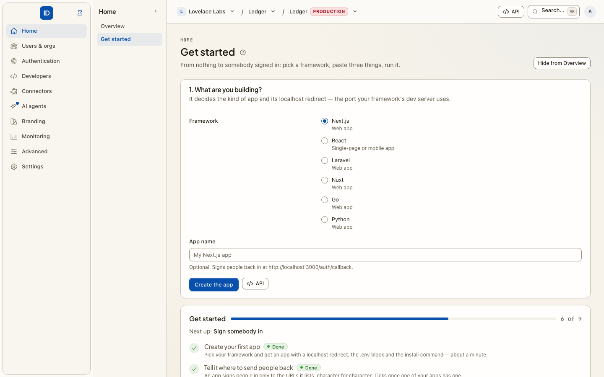

# Quickstarts

Each page takes one framework from an empty project to a person signed in through Cbox
ID: register the app, install the SDK, set the environment, add the sign-in and callback
routes, protect a page, sign out. Expect about ten minutes.



## Pick your framework

| You are building | App kind to register | SDK | Quickstart |
|---|---|---|---|
| Next.js (App Router) | Web app | `@cboxdk/id-js` | [Next.js](nextjs.md) |
| React single-page app (Vite) | Single-page or mobile app | `@cboxdk/id-js` + `@cboxdk/id-react` | [React](react.md) |
| Laravel | Web app | `cboxdk/laravel-id-client` | [Laravel](laravel.md) |
| Nuxt | Web app | `@cboxdk/id-nuxt` | [Nuxt](nuxt.md) |
| Go (`net/http`) | Web app | `github.com/cboxdk/id-go` | [Go](go.md) |
| Python (Flask) | Web app | `cbox-id-client` (installed from git) | [Python](python.md) |

Building a CLI instead? See [Sign in from a CLI](../getting-started/sign-in-from-a-cli.md).
For the reasoning behind each step, see [Integrate your app](../getting-started/integrate-your-app.md).

## Before you start

Every quickstart needs the same three things.

1. **An environment.** Cbox ID is organized as workspace → project → environment →
   organizations → users. Your app signs people in to one environment, and each
   environment is a hard boundary with its own users, keys and issuer. Use a sandbox
   environment while you follow a quickstart. If you do not have one yet, create a
   project and an environment from **Projects** in your workspace console. See
   [Workspaces & organizations](../core-concepts/workspaces-and-organizations.md).
2. **An application.** Step 1 of every quickstart registers it, in the environment
   console, with the `cbox` CLI, or with the REST API. You come away with a client ID
   and, for a web app, a client secret that is shown once.
3. **Its issuer.** Each environment is its own issuer, on its own host:
   `https://<environment>.cboxid.com` on the hosted platform, or your own host if you run
   Cbox ID yourself. Confirm it with:

   ```bash
   curl https://<environment>.cboxid.com/.well-known/openid-configuration
   ```

   Use the `issuer` value from that response, character for character. The root host,
   `cboxid.com`, is **not** an identity provider: it answers 404 to discovery, and an SDK
   pointed at it fails before the first redirect.

## The localhost redirect URIs

The quickstarts use the same redirect URI the console's **Get started** page registers for
each framework, so an app created there works without editing:

| Framework | Redirect URI |
|---|---|
| Next.js | `http://localhost:3000/auth/callback` |
| React (Vite) | `http://localhost:5173/callback` |
| Laravel | `http://localhost:8000/auth/callback` |
| Nuxt | `http://localhost:3000/auth/callback` |
| Go | `http://localhost:8080/auth/callback` |
| Python (Flask) | `http://localhost:5000/auth/callback` |

Redirect URIs are matched exactly. When you deploy, register the production URI as well.
