# Screens

A visual tour of the Cbox ID app — the admin console and the sign-in surface.
Screenshots are of the running app (dark theme) with a demo organization.

## Sign-in surface

### Login

Password sign-in, plus **passwordless options**: email magic link and **passkey**
(WebAuthn) sign-in. Social buttons (Google/GitHub/Microsoft) appear when a provider
is configured. Organizations get a branded variant at `/o/{slug}/login`.

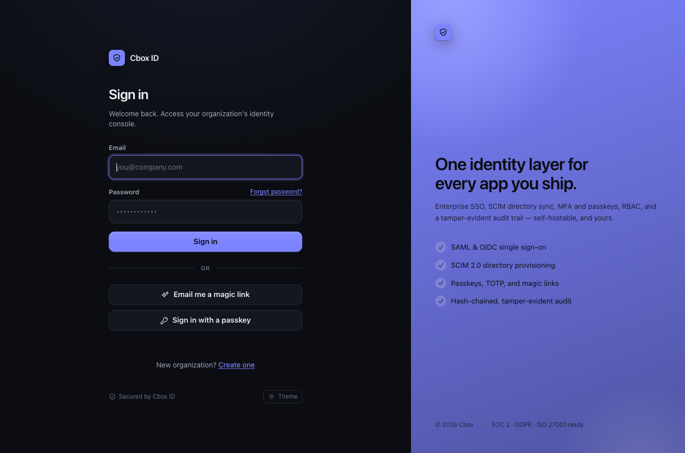

### Signup

Create a new organization and its first owner. Risk scoring runs on submit
(monitor mode by default).

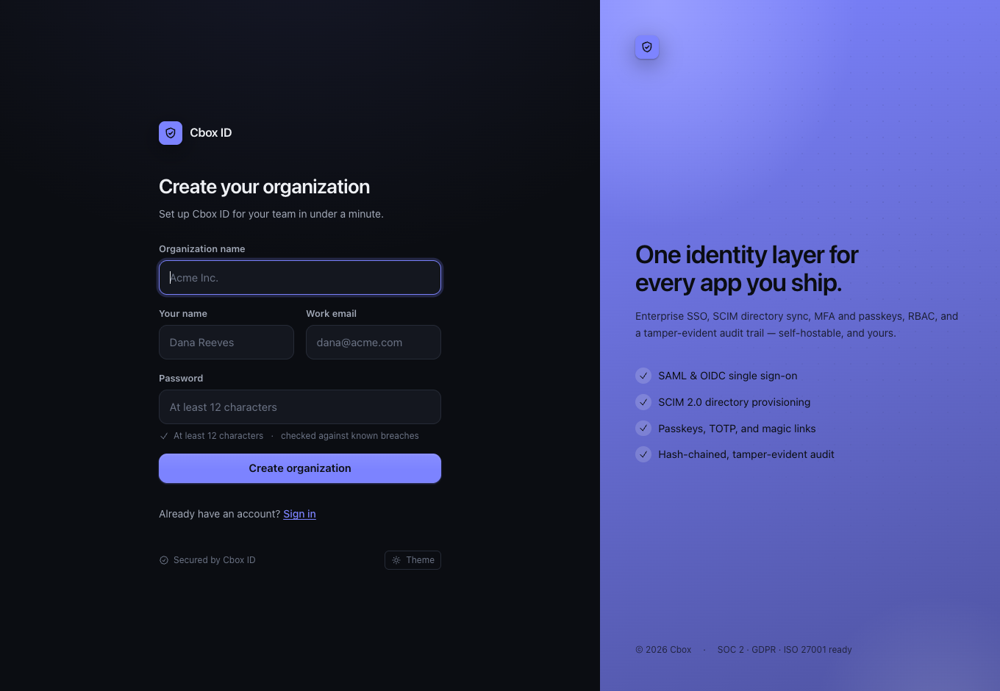

## Admin console

### Overview (dashboard)

The org's home: member count, enterprise-SSO status, your role, a live **recent
activity** feed from the tamper-evident audit log, and an onboarding checklist.

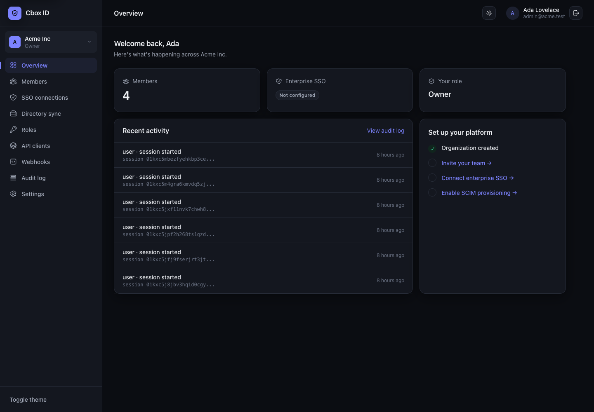

### Members

The org's people and their roles (Owner / Admin / Member). Invite, change role, or
remove — every change is audited.

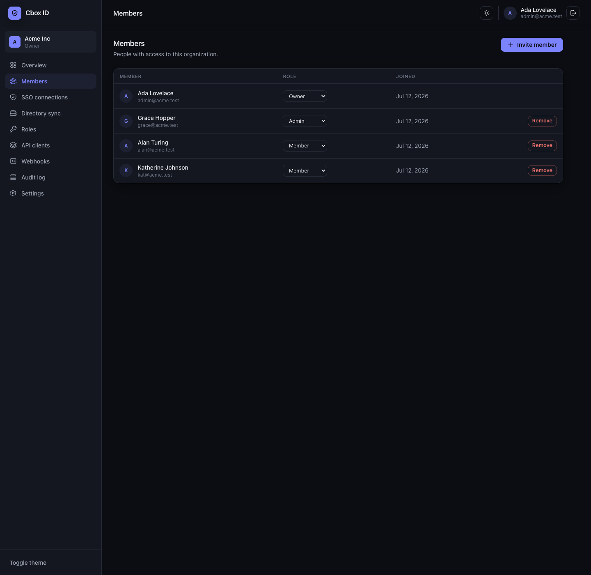

### SSO connections

Per-organization enterprise SSO — connect the customer's own IdP (SAML / OIDC) so
their staff log in with it.

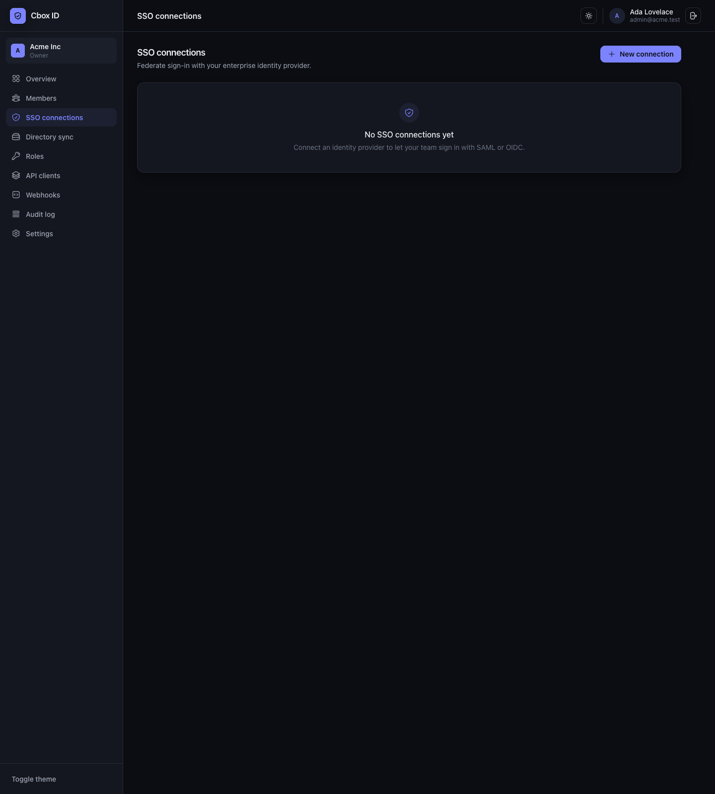

### Directory sync (SCIM)

Automatic user provisioning/deprovisioning from the customer's directory over
SCIM 2.0; deprovision revokes sessions immediately.

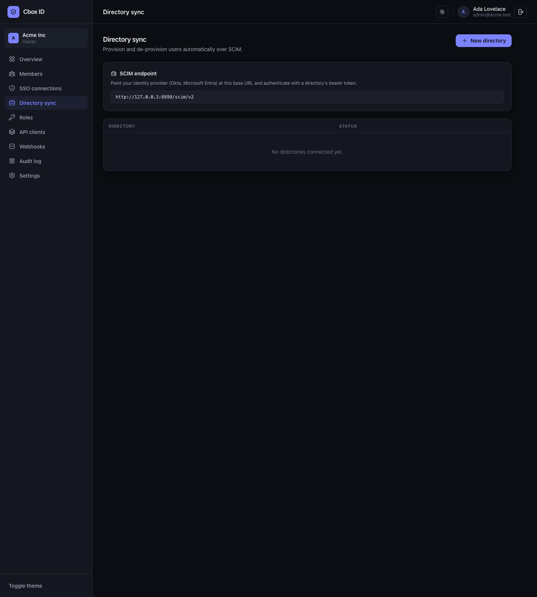

### Roles

Role and permission management, org-scoped, with hierarchy-aware roll-down.

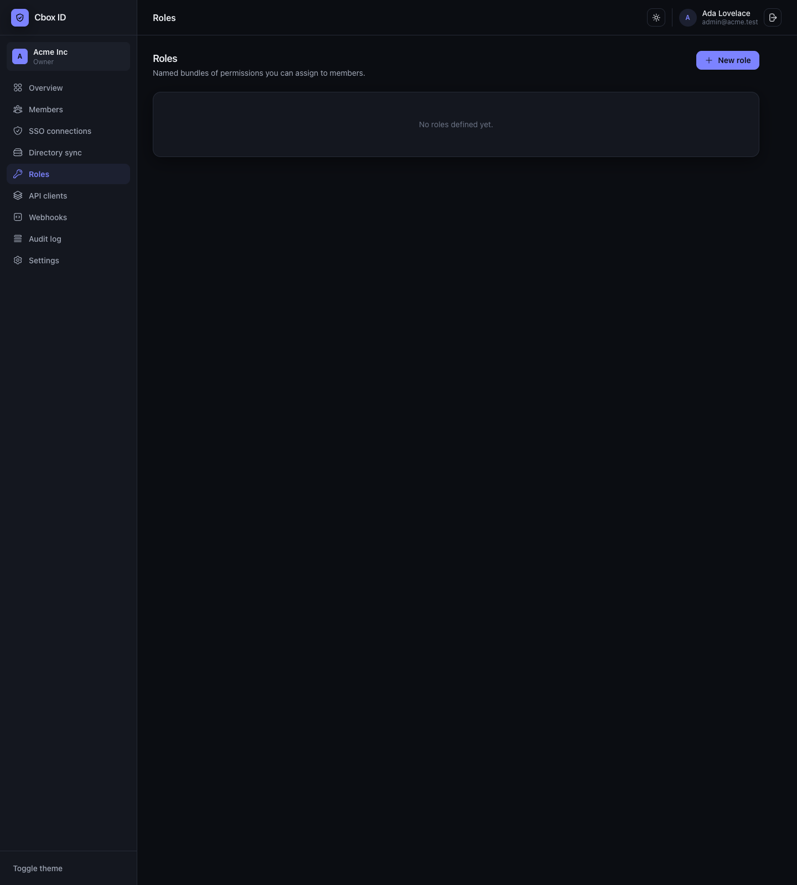

### API clients

OAuth clients registered against this instance — for products authenticating via
OIDC, or MCP clients self-registering through Dynamic Client Registration.

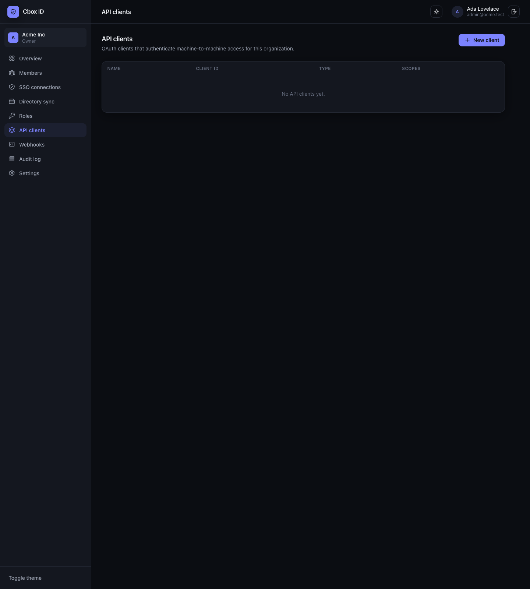

### Webhooks

HMAC-signed event delivery endpoints with retries; the console shows registered
endpoints and delivery history.

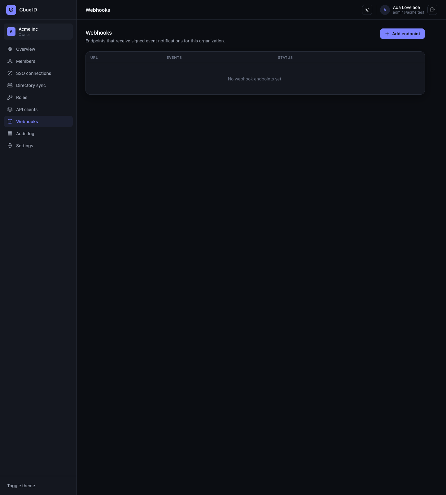

### Audit log

The append-only, hash-chained audit trail — filterable, exportable to your SIEM.

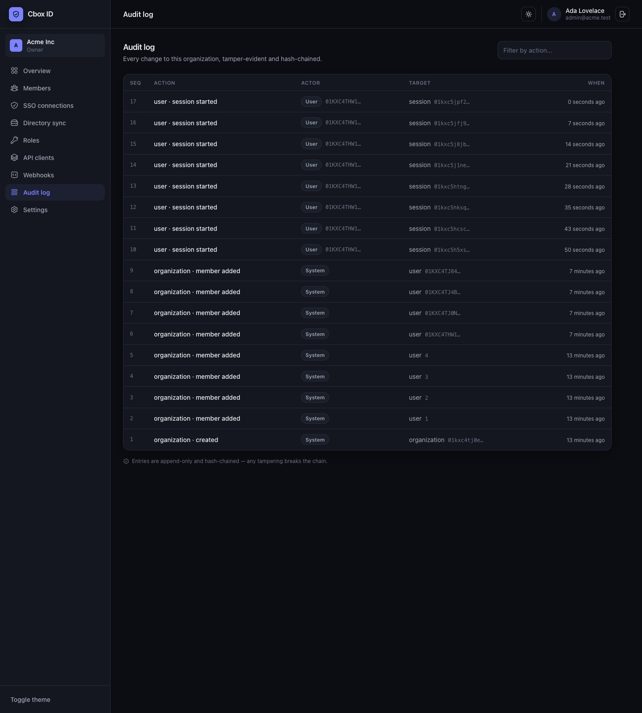

### Settings

Organization details, **per-org login branding**, two-factor authentication,
**passkey** enrolment, and the current session (auth methods, expiry, and
sign-out-everywhere).

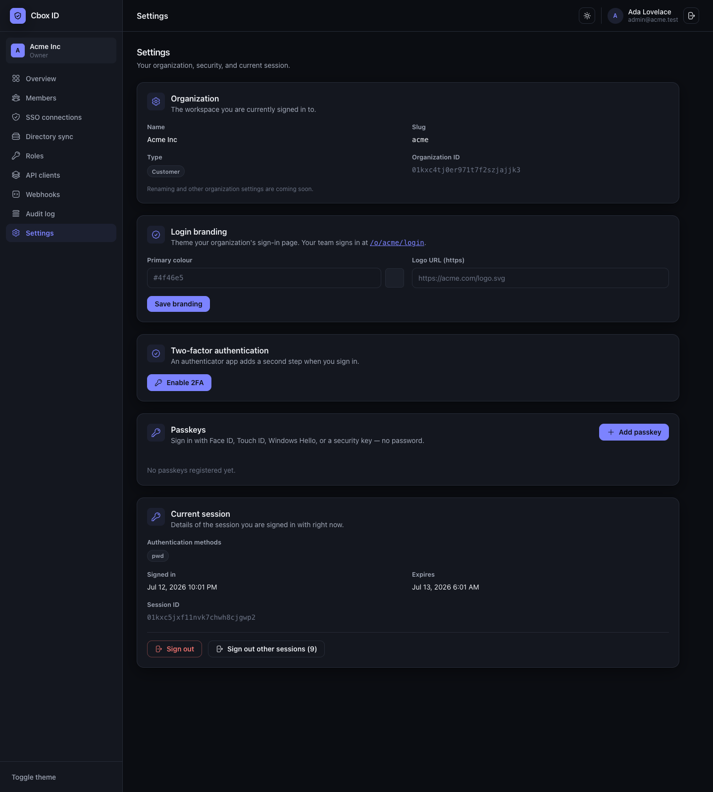

### Organization switcher

A signed-in user who belongs to several organizations switches the active tenant
from the sidebar card. The switch is server-verified against membership — you can
only switch into an org you actually belong to — and the role updates with it
(here: Owner in Acme, Admin in Globex).

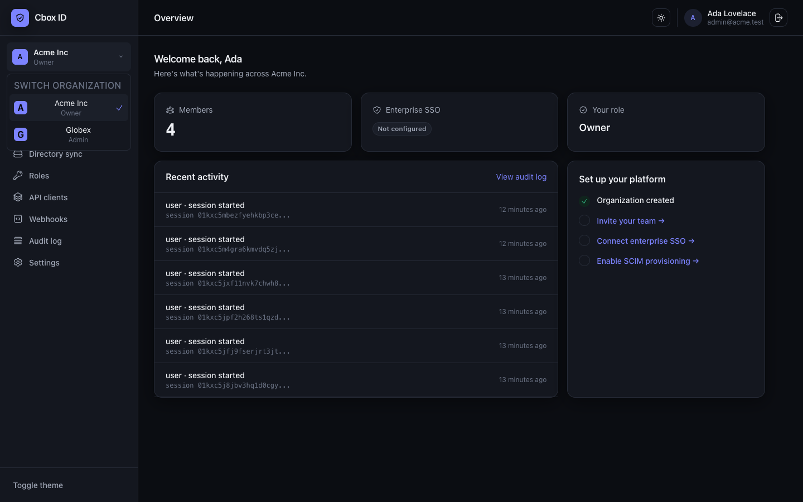

### Responsive (mobile & tablet)

Below the `lg` breakpoint the sidebar collapses into an off-canvas **navigation
drawer** (hamburger in the top bar) holding the full nav, org context, theme
toggle and sign-out; content stacks to a single column and wide tables scroll
within their card. The sign-in split-screen collapses to a centered form. Verified
at phone (390px) and tablet (768px) widths.

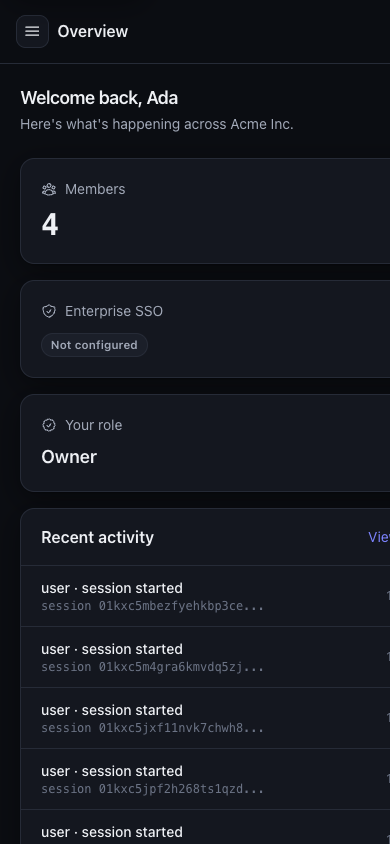

## Notes

- Server-rendered (Livewire + Volt), session-cookie auth, minimal JS — chosen
  because this *is* the login surface. See the framework
  [security model](../../packages/laravel-id/docs/security.md).
- **Accessibility:** the auth and console pages pass an automated axe-core
  WCAG 2.1 A/AA audit (guarded by a regression test); keyboard-navigable with a
  skip link, labelled landmarks and controls.
- To reproduce these locally: `php artisan migrate`, seed a demo org
  (`php artisan db:seed --class=DemoSeeder`), then sign in.
